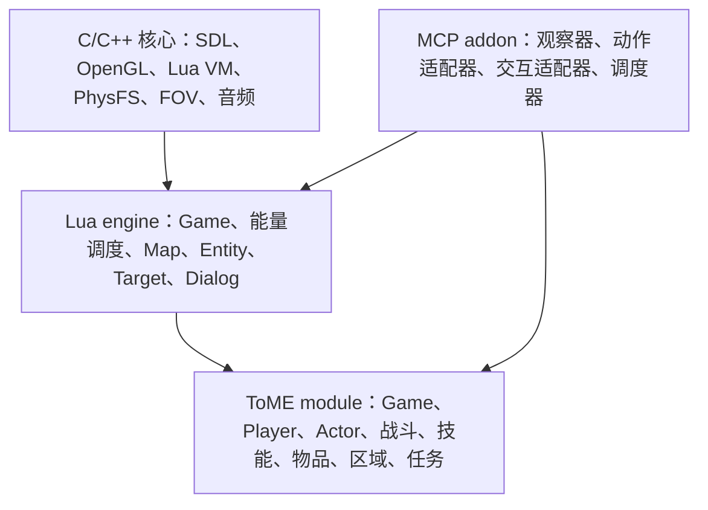
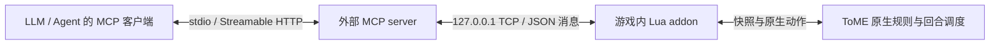
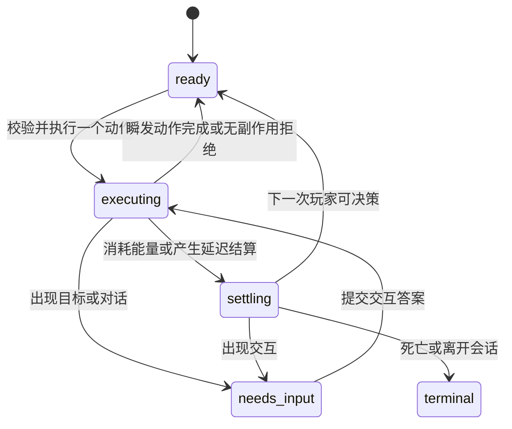

# ToME 4：通过 addon 接入 MCP 的架构分析

> **历史资料，非规范（Historical / non-normative）。** 本文是当时的设计分析记录。其中“读取不能改变游戏 /
> 观察纯度（相同状态重复观察不改变随机数状态，也不额外调用随机函数）/ 只读不调用 RNG、技能预检或动态
> 说明函数”等前提已被 `AGENTS.md` 与 `docs/tome-mcp-auto-combat-plugin-design.md` §8.3 **取代**。当前规则：
> 读取只有两条红线（**不提交动作、不泄露玩家未知信息**），当前实时的 getter/builder 可调用（允许消耗
> RNG/有读副作用）；报错/缺失/`nil` 时标 `unknown`。保留原文仅作历史证据。

分析日期：2026-09-15。依据当前工作区的 ToME / T-Engine 1.7.6 源码（HEAD `624a67329f`），以及工作区中的 Battle Companion、Danger Alert。后两者当前不在 Git 跟踪中，本文将其视为本地实现参考。

本文保留初始源码分析和接口设计，下文的工具名、状态字段和目录结构均为设计建议。后续已实现首版；最终接口以 [v1 契约](tome-mcp-v1-contract.md) 和 [安装使用说明](../README.md) 为准，实际验证范围见 [验收记录](../VALIDATION.md)。

首版范围按用户要求：假定游戏联网能力可用，采用本机 TCP 通信，暂不处理游戏禁用联网的场景。

## 1. 结论

**可行。基础状态读取、移动、等待和部分技能操作具备纯 Lua addon 的实现条件，预计无需修改 C 引擎。推荐采用“游戏内 addon + 游戏外 MCP server”。**

游戏内 addon 负责观察和执行，外部服务负责 MCP 协议及请求管理，LLM 负责决策。通用战斗和完整流程的主要工作量在技能交互、UI 适配和状态一致性，而不是 MCP 报文传输。

| 目标 | 判断 | 主要工作 |
| --- | --- | --- |
| 读取玩家、当前场景、技能和背包 | 可行性高 | 筛选信息、构造无副作用的快照 |
| 单步移动、等待、普通攻击 | 可行性高 | 原生操作入口、行动边界和结果检测 |
| 已适配的自用／单目标技能 | 可行性高 | 目标绑定、施法检查、结果与异常处理 |
| 任意职业、任意技能 | 可行，但适配量大 | 多次选目标、特殊对话、持续技能、物品技能 |
| 探索、换层、任务、装备、商店 | 可逐步实现 | 原生限制和各类对话框适配 |
| 从主菜单到通关完全无人值守 | 不能由基础接口直接保证 | 出生、升级、剧情、死亡、插件兼容、长期规划 |
| 高速无界面训练／确定性回放 | 需要另行研究 | 图形主循环、随机数、存档、批量运行隔离 |

## 2. 游戏架构及接入位置



### 2.1 C 核心提供运行环境，规则主要在 Lua

- [`src/main.c`](../../../../src/main.c) 的 `boot_lua` 创建 Lua 环境并注册 PhysFS、LuaSocket、FOV 等绑定；`on_tick` 调用当前 Lua 游戏对象的 `tick`。
- [`game/loader/pre-init.lua`](../../../../game/loader/pre-init.lua) 支持 LuaJIT；[`game/loader/init.lua`](../../../../game/loader/init.lua) 设置模块加载机制。
- [`engine/Map.lua`](../../../../game/engines/default/engine/Map.lua) 将地形、陷阱、角色、投射物、物品分层组织，底层部分能力使用 C 数据和算法。
- [`mod/class/Actor.lua`](../../../../game/modules/tome/class/Actor.lua) 通过 `class.inherit` 组合生命、属性、资源、技能、背包、投射和战斗等接口；这是类与接口组合，不宜将整个游戏理解为通用 ECS。
- 技能、效果、NPC、区域等定义主要位于 `game/modules/tome/data/`，包含运行时函数，不能当成一份静态数据库直接全部序列化。

MCP addon 可以在 Lua 中访问 `game.player`、`game.level`、`game.zone`、角色技能和物品对象。应从中提取普通数据，而不是导出整个对象图。

### 2.2 addon 的扩展能力足够

[`engine/Module.lua`](../../../../game/engines/default/engine/Module.lua) 的 `loadAddon` 支持：

| 机制 | 行为 | 本方案用途 |
| --- | --- | --- |
| `hooks` | 绑定既有事件 | 初始化、游戏开始、换层、设置入口 |
| `superload` | 利用 `loadPrevious(...)` 包装原类 | `Game:display`、`Player:act`、对话及保存边界 |
| `overload` | 将 addon 文件加入虚拟文件系统，亦可覆盖原文件 | 放置独立的 `mod.mcp_bridge.*` 模块 |
| `data` | 挂载独立数据目录 | 文案、配置等 |

优先用 hooks 和薄 superload，新增文件使用独立命名空间。载入器在 superload / overload 注册后运行 hooks；已提前加载的引擎类或既有输入对象仍需单独核查。

普通 ToME addon 主要在进入该游戏模块时生效。出生界面可以进一步适配；启动器、模块选择和主菜单属于 boot 模块，不能假设仅包装 `mod.class.Game` 就覆盖了所有启动阶段。

载入存档时，`Module:load` 会将存档记录的 addon 集合交给 `loadAddons`。首版宜用启用 addon 后创建的测试角色验证；向既有存档加入 addon 需要单独确认加载流程。

### 2.3 回合机制很适合等待 LLM

继承关系为：

```text
mod.class.Game
  → engine.GameTurnBased
    → engine.GameEnergyBased
      → engine.Game
```

[`Player:act`](../../../../game/modules/tome/class/Player.lua) 在玩家具有行动能量且未运行休息／奔跑时设置 `game.paused = true`；`Player:useEnergy` 在能量不足后解除暂停，允许世界继续结算。

ToME 初始化的行动阈值为 1000、基础 tick 能量增量为 100。行动速度会改变节奏，瞬发技能可能不消耗能量。因此：

- 模型思考期间可以停留在原生等待输入状态，通常不推进战斗时间。
- 一个指令不等于一个 `game.turn`；`game.turn` 也不等于玩家行动次数。
- `game.paused` 只是必要条件之一，还要检查能量、角色归属、目标选择、模态对话、保存和切图状态。
- 原生休息、奔跑、自动施法或其他控制 addon 可能自行行动，需要明确控制权。

## 3. 推荐部署：addon + 外部 MCP 服务



MCP 的标准传输包括 stdio 和 Streamable HTTP，消息使用 JSON-RPC。外部服务可使用与客户端匹配的 SDK；内部游戏桥接协议独立版本化。[MCP 传输规范](https://modelcontextprotocol.io/specification/2026-07-28/basic/transports)

### 为什么拆成两个组件

- 游戏 addon 使用 Lua，外部服务可以使用 Python 或 TypeScript，处理 MCP schema、协议兼容和请求生命周期。
- 游戏主线程不等待模型生成或网络响应。
- 游戏 stdout 包含大量引擎日志，不能直接作为干净的 MCP stdio 通道；外部服务独占自己的协议 stdout。
- addon 不需要保存模型 API key，也不依赖某个模型厂商。

在 addon 内完整实现 HTTP MCP 服务，联网可用时理论上也能做，但会增加协议实现、主循环调度和版本兼容成本。

### 3.1 首版采用本机非阻塞 TCP

[`src/main.c`](../../../../src/main.c) 注册 LuaSocket 核心，[`game/thirdparty/socket.lua`](../../../../game/thirdparty/socket.lua) 提供 Lua 接口，原生 TCP 绑定包含 `bind`、`listen`、`accept`、`receive`、`send` 和 `settimeout`。

推荐连接方向：**addon 监听 `127.0.0.1` 的可配置端口，外部 MCP server 主动连接。** addon 随游戏加载；外部服务由 MCP 客户端启动，重连后重新确认游戏会话。

1. 监听 socket 和连接 socket 都设置 `settimeout(0)`；accept、收发都不阻塞游戏主线程。
2. 内部协议采用 UTF-8 JSON，一条消息一行，字符串换行必须转义；包含协议版本、请求 ID、会话 ID、操作名及参数。
3. 接收端保留半包缓冲，一次读取可以得到零条、一条或多条消息；发送端保留尚未发送完成的字节及偏移。
4. 限制单条消息大小、队列长度和每帧处理量；大快照用范围查询和分页，避免收发或序列化占满一帧。
5. 通过实例凭据与控制租约限定当前控制者；同一游戏内的写操作串行。
6. 心跳、连接状态和 `session_id` 独立于游戏回合；断线停止后续自动动作，重连先查询未确认命令。
7. 对端 TCP 断开或重连不自动创建新的游戏业务会话；游戏重启／读档才使旧会话失效，避免已执行指令被重放。

通信接收只解析并排队，由动作调度器在原生安全边界执行。不能在 `receive` 成功后无条件立刻操作角色。

TCP 是游戏与外部服务之间的内部通道，外部服务向客户端提供标准 MCP 接口。首版外部服务建议用 stdio，远程部署时再选择 Streamable HTTP。

### 3.2 编解码与消息边界

JSON 编解码建议使用独立、严格的 Lua 5.1 兼容模块。仓库的旧 [`Json2.lua`](../../../../game/thirdparty/Json2.lua) 有 `loadstring` 解码分支及非标准转义处理，应经过专项验证后才考虑复用。请求只表达动作数据，不接受任意 Lua 源码或任意方法调用。

## 4. 状态接口：为决策组织信息

### 4.1 一个默认快照应包含什么

| 部分 | 建议字段 |
| --- | --- |
| 身份和一致性 | `session_id`、`level_instance_id`、`revision`、`world_tick`、`player_id` |
| 运行阶段 | 等待指令、结算中、选目标、对话、保存、切图、死亡 |
| 玩家 | 坐标、生命、负生命阈值、护盾、资源、速度、负面效果、可行动状态 |
| 局部地图 | 坐标原点、尺寸、可见格、记忆格、未知格、门、已知楼梯 |
| 当前感知实体 | ID、名称、位置、阵营关系、可获知的生命和状态、感知来源 |
| 环境 | 已知陷阱、区域效果、可感知投射物、脚下危险 |
| 技能摘要 | 稳定 ID、名称、等级、冷却、激活状态、已知成本、目标类型、支持程度 |
| 可选动作 | 候选动作、已知限制、仍待原生执行检查的条件 |
| UI 与反馈 | 当前交互、可选答案、最近日志、上一动作结果 |

背包、装备完整属性、任务和技能长说明按需读取，避免每次交互重复发送。局部地图使用带原点的字符网格或稀疏 JSON，统一为游戏的 0 起点坐标，明确 x 向右、y 向下及八方向移动。

默认返回小快照；提供 `sections`、`radius`、`since_revision` 和事件游标。日志使用有界缓冲，截断时返回缺失标记；文本名称用于展示，动作引用使用 ID。

### 4.2 “可读到”与“玩家知道”需要区分

游戏内对象包含迷雾外敌人、隐藏陷阱和内部状态。默认采用玩家视角，调试全知模式可作为另一个显式模式。

- `map.seens`、`map.has_seens` 分别用于当前感知／历史记忆相关判断，但也要核对实体感知及对象已知状态。
- 记忆地图只保留上次观察到的内容，不能用后台最新地形替换记忆而泄露变化。
- 隐身、潜行、失明、心灵感应需沿用原生结果；感知到角色不代表已获知它的全部技能、装备和精确资源。
- `inspect(entity_id)` 必须使用相同的信息边界，不能通过猜测 ID 绕过过滤。
- UID 读档后会重新分配。对外实体 ID 应绑定本次会话和场景，物品堆叠／拆分后重新解析。

### 4.3 读取不能改变游戏

[`Actor:canSee`](../../../../game/modules/tome/class/Actor.lua) 在缓存缺失时调用 `canSeeNoCache`，其中存在随机判定。`preUseTalent` 有解析缓存、插件 hook、失败判定和能量消耗路径，连 `fake=true` 也不应假设对所有插件都无副作用。

观察器应优先消费原生已经产生的可见性结果和经过核对的数据字段；描述／成本等函数仅按适配规则调用。未知字段标为 `unknown`，而不是现场运行技能来探测结果。

因此 `available_actions` 更准确地表示“候选动作及已知限制”，不能承诺动作必定成功。几何和伤害预估也要标明覆盖范围，不能靠执行 `project` 或技能 `action` 来做只读预览。

## 5. 操作接口：沿用原生规则

| 动作 | 原生参考入口 | 注意事项 |
| --- | --- | --- |
| 移动 | `player:moveDir(dir)` | 沿用移动、碰撞、地形触发；明确撞击攻击和滑步行为 |
| 移动或攻击 | `player:attackOrMoveDir(dir)` | 与原生对应指令一致，避免假设所有移动只改变坐标 |
| 等待 | `player:waitTurn()` | 会处理装填和 `callbackOnWait`，不只是扣能量 |
| 使用技能 | `player:useTalent(...)` | 保留资源、冷却、装备、控制状态和原生结算 |
| 换层 | `Game:setupCommands` 中的 `CHANGE_LEVEL` 路径 | 检查楼梯、禁止移动、负面效果和区域条件 |
| 装备／物品 | `doWear`、`doTakeoff`、原生物品使用流程 | 适配容器、堆叠、能量与确认交互 |
| 剧情选择 | 当前 `engine.dialogs.Chat` 实例的 `use` | 使用当前展示的选项和原有回调 |

`game.key:triggerVirtual(...)` 可用于复用部分已有命令，但必须确认当前输入上下文。不要对一个正打开的模态窗口盲发主游戏命令。直接调用 `game:changeLevel(...)` 也不等价于玩家使用楼梯，它会绕过上层检查。

### 5.1 简单技能可以直接传目标

[`ActorTalents:useTalent`](../../../../game/engines/default/engine/interface/ActorTalents.lua) 接受 `force_target`，临时绑定 `getTarget`，在技能流程完成后恢复。例如经适配的单目标技能可走：

```lua
player:useTalent(talent_id, nil, nil, nil, target)
```

这里的 `force_target` 表示提供目标，并不等于忽略冷却或免费施法。仍需检查目标合法性、角色已学习技能以及具体目标协议。首版应适配已知技能；坐标目标还需要区分空地与角色，不能把任意 `{x,y}` 都当作 Actor。

### 5.2 通用技能必须支持挂起交互

`useTalent` 使用 coroutine，[`GameTargeting:targetGetForPlayer`](../../../../game/engines/default/engine/interface/GameTargeting.lua) 会 yield 等待目标。技能也可能调用物品列表、确认框或多次选择。

需要将交互表示为：

```text
needs_input
  prompt_id
  kind: target | choice | confirmation | item
  allowed_choices / targeting_spec
```

后续 `respond(prompt_id, ...)` 通过相应原生交互入口恢复协程。读取 Chat 已生成的 `list`，避免为观察而重新运行 `generateList`，后者会执行自动处理和条件函数。未适配的对话返回明确状态，保留原生窗口让玩家接管。

## 6. 核心：动作状态机与一致性



### 6.1 调度位置

1. `Game:display` 后进行轻量、限频通信轮询，使原生等待输入期间也能接收请求。
2. `Player:act` 包装只记录原生玩家就绪信号。
3. 接收请求后，通过 `game:onTickEnd` 排入游戏主线程动作队列，再次验证状态后执行。
4. 原生世界自然结算，在后续稳定边界生成快照并完成请求。

**`onTickEnd` 的名字不保证整次行动已经结算完。** 它由 `engine.Game:tick` 执行，而外层能量调度还可能继续运行。必须结合玩家就绪信号、能量、UI 和相关延迟任务判断完成，不能仅在回调退出时回复“回合结束”。

只包装 `Game:tick` 轮询通信可能在原生暂停后收不到新命令；C 主循环存在 `tickPaused` 和事件等待。显示轮询已有本地 addon 示例，但窗口失焦、最小化、低帧率及渲染停止时仍须做平台验证。外部服务应通过心跳识别停滞，而非让调用无限等待。

### 6.2 请求与结果

所有写操作串行。请求至少携带：

```json
{
  "session_id": "game-session-7",
  "command_id": "cmd-0042",
  "expected_revision": 81,
  "action": {
    "type": "use_talent",
    "talent_id": "T_LIGHTNING",
    "target_id": "actor-17"
  }
}
```

结果中分开表示：

- `accepted`：请求是否通过桥接校验。
- `action_status`：已排队、执行中、待交互、完成、原生失败、结果待确认。
- `energy_spent`、资源／生命／冷却变化、世界 tick 前后值。
- 下一状态快照及 `revision`。

施法失败也可能消耗能量并让敌人行动。因此“原生返回 false”不能一律作为“没有改变游戏”，更不能自动重试。普通攻击未命中同样可以是一个已完成的动作。

### 6.3 必须落实的语义

- **过期状态拒绝：** 在真正执行时核对 `expected_revision`。revision 覆盖行动、瞬发技能、UI、换装、手动输入和场景变化；不能只用 `game.turn`。
- **防重复执行：** 同一会话内缓存 `command_id` 的请求摘要与结果；重复 ID / 相同参数返回已有结果，不同参数报冲突。游戏侧必须参与去重。
- **重启边界：** 读档／重启生成新会话。动作落地后、响应写出前若崩溃，结果可能不确定；不宣称跨崩溃 exactly-once，不盲目重放。
- **超时与取消：** 超时不等于未执行。提供 `status(command_id)`；`stop` 取消未开始动作和批量计划，已发生的动作及当前原生结算正常结束。
- **目标重查：** 执行前重新解析对象及其位置、感知状态和合法性；切图、死亡、控制角色切换后旧引用失效。
- **人工接管：** 普通键鼠操作撤销控制权、清理待执行命令并推进 revision；再交给原生输入处理器。
- **运行态隔离：** socket、队列、协程引用、控制租约和活动命令留在模块内存；仅偏好配置进入人物存档。

## 7. 面向 LLM 的 MCP 工具

建议先提供少量稳定工具。技能和物品由 ID 参数引用，不必为每一个技能注册一个 MCP tool。

| 工具 | 用途 |
| --- | --- |
| `tome.connect` | 枚举／绑定游戏实例，返回显式会话句柄、版本、观察模式和能力 |
| `tome.observe` | 获取当前快照，支持范围和增量；稳定性由 `phase` 明示 |
| `tome.inspect` | 查询某项技能、已知实体、物品或任务的细节 |
| `tome.act` | 执行一个语义动作，尽可能返回下一次可决策状态 |
| `tome.status` | 查询先前命令，恢复超时或断连后的判断 |
| `tome.stop` | 取消后续自动动作并交还控制 |

第二阶段再加入 `tome.respond` 和有边界的 `tome.run_until`。快照可带候选动作和可选的短期 `action_token`，减少模型拼错参数；执行时仍需重新验证。

动态游戏状态优先通过工具返回 `structuredContent` 并定义输出 schema；规则和技能说明可提供 `tome://rules`、`tome://talents/...` 等 resources，并保留 `inspect` 工具供客户端按需访问。会话句柄是游戏业务层的显式参数。[MCP 工具规范](https://modelcontextprotocol.io/specification/2026-07-28/server/tools)；[资源规范](https://modelcontextprotocol.io/specification/2026-07-28/server/resources)

接口设计与 MCP 协议版本解耦，具体实现选择目标客户端支持的协议和 SDK 版本。

### 模型操作循环

```text
connect → observe
        → 必要时 inspect
        → act（一个动作）
        → 返回下一决策状态／needs_input／未完成命令句柄
        → 再决策
```

战斗采用单步闭环。长距离移动、休息、探索再用受限宏动作，例如最多执行 N 次、遇敌停止、受伤停止、出现对话停止；每个内部步骤都在游戏主线程重新检查条件。这样可减少推理往返，同时保留中途停止能力。

## 8. 当前工作区可复用的经验

| 本地实现 | 可参考部分 | 不能直接推导的能力 |
| --- | --- | --- |
| [Battle Companion / Scene](../../../../game/addons/tome-battle-companion/overload/mod/battle_companion/Scene.lua) | 普通数据快照、可见性缓存、候选技能、目标路径 | 完整玩家视角、全职业及全 UI 覆盖 |
| [Battle Companion / Executor](../../../../game/addons/tome-battle-companion/overload/mod/battle_companion/Executor.lua) | 原生 `useTalent`、普通近战、执行前检查 | 任意技能、协程交互和复杂物品操作 |
| [Battle Companion / Controller](../../../../game/addons/tome-battle-companion/overload/mod/battle_companion/Controller.lua) | display pump、onTickEnd、玩家就绪、手动中断、运行态隔离 | 外部命令重试、会话协议和完整游戏代理 |
| [Danger Alert / Readonly](../../../../game/addons/tome-danger-alert-/overload/mod/danger_alert/Readonly.lua) | 受限读取及未知字段处理的设计 | 任意 Lua 函数都能被无副作用执行 |

Battle Companion 的 [VALIDATION.md](../../../../game/addons/tome-battle-companion/VALIDATION.md) 记录了真实游戏中的施法、资源／能量消耗、玩家接管和读档验证。这是已有验证记录，本次没有重跑，亦不是 MCP 链路已验证的证据。

建议将 MCP addon 独立成包，参考这些执行机制；Danger Alert 可作为可选的战术分析工具。原生操作通道不必依赖危险评分，不应把战斗助手当前较窄的保守策略直接作为 LLM 可执行动作的全集。

## 9. 建议目录与实施顺序

```text
game/addons/tome-mcp-bridge/
  init.lua
  hooks/load.lua
  superload/mod/class/Game.lua
  superload/mod/class/Player.lua
  overload/mod/mcp_bridge/
    Runtime.lua
    TransportSocket.lua
    Protocol.lua
    Observer.lua
    Actions.lua
    Interactions.lua

tools/tome-mcp-server/
  ...外部服务、schema 和客户端接入说明...
```

### 阶段一：最小闭环

- 进入已启用 addon 的角色，绑定单个本地会话。
- 非阻塞 TCP 消息往返；读取玩家、局部地图、当前感知实体、技能摘要、UI 状态。
- 移动、等待、普通攻击、少数已适配自用／单目标技能。
- 一个请求一个动作；版本检查、去重、命令查询和人工接管。
- 遇到复杂交互返回 `needs_input` / `unsupported_interaction`，并保留原生交互。

### 阶段二：可持续游玩

- 原生目标选择和常见确认／列表交互。
- 背包、装备、拾取、物品使用、楼梯、休息和探索。
- 场景及任务变化；角色切换；稳定的断线恢复。
- 更多职业技能及已支持 addon 组合。

### 阶段三：长程代理

- 出生、升级、技能加点、商店、剧情与死亡流程。
- 有停止条件的批量动作和长期任务记忆。
- 后台运行、多实例隔离和远程 MCP 服务部署。

### 验收重点

1. **观察纯度：** 相同状态下重复观察不改变能量、资源、冷却、地图、随机数状态，也不额外调用随机函数；隐身／迷雾信息没有泄漏。
2. **单步正确性：** 原生资源和能量正常扣除、敌人正常行动，回复落在定义的边界；瞬发、失误、控制状态也正确处理。
3. **传输可靠性：** TCP 半包、部分发送、重复请求、超时、服务重连不会多走一步；游戏重启后的旧命令失效。
4. **交互正确性：** 目标协程、多次选目标和对话期间不会执行无关世界动作。
5. **运行环境：** 窗口失焦／最小化／保存／切图时能识别忙碌或停滞。
6. **可接管：** 手动输入、停止和读档不会恢复过期自动动作。

优先使用隔离的新测试角色和已有原生测试框架补充 MCP 往返场景。静态分析可以证明接入点存在，实际稳定性仍由这些集成场景验证。

## 最终建议

以 **独立 MCP bridge addon、外部 MCP server、本机非阻塞 TCP、单动作闭环** 开始。先证明“观察不改状态”和“动作严格经过原生结算”，再扩展技能与 UI。

ToME 的 Lua 扩展机制和等待玩家输入的回合设计，使它很适合这类接入；决定使用体验的是快照质量、目标／对话适配以及可靠的行动边界。
