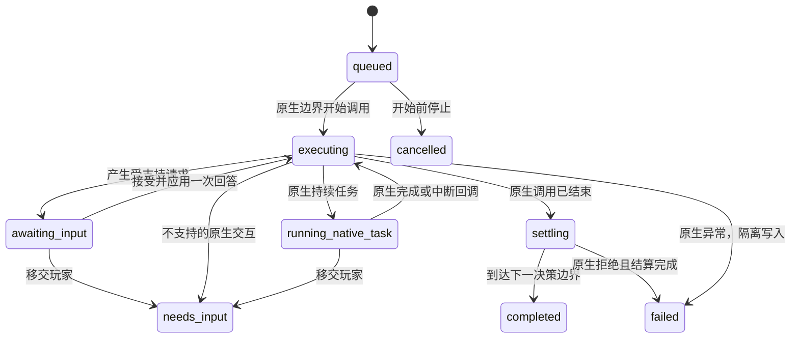

# MCP 按交互能力支持技能：设计方案

> **Supersession banner (v1.6 / `AGENTS.md` + design §8.3).** 本文是 0.4.0 时期的设计提案。
> 其中 §2.5 “observe/inspect/status 不得调用 `preUseTalent`/动态 `target`/`info`…不消耗 RNG”与
> §3.1 “关键入口被不兼容替换时整体禁用对应能力”的前提已被**取代**：当前协议为 **v4**，读取只有两条
> 红线（不提交动作、不泄露玩家未知信息），当前实时的动态 getter/builder **可以调用**（允许 RNG/读副作用）；
> 插件以游戏内实际入口为准，**不为其它 addon 替换实现的错误负责**，替换本身不是拒绝理由。
> 本方案的能力模型与交互转译仍作架构参考。

日期：2026-09-15。基于当前 ToME 1.7.6 与 MCP Bridge/Python 0.4.0 源码。状态：**设计提案，尚未实现或进行原生游戏验收**。

前置分析：[Rush 释放流程与现有架构](tome-mcp-rush-analysis-plan.md)。本文采用新的扩展方向：把主要适配单位从技能 ID 改成原生交互，不再要求每个普通技能单独登记执行白名单。旧版协议的兼容适配可以保留。

## 1. 核心决策

**原生引擎负责“技能怎么执行”，Bridge 负责“当前交互怎么表达、回答，以及何时结束”。**

统一调用正常的 `player:useTalent`。引擎执行到选点、确认、列表或原生等待时，Bridge 将当前交互转成有限的结构化请求；客户端回答后，由原生入口继续同一次调用。新增一个使用已有交互的技能，原则上无需修改 Bridge。

适配器按以下接口登记：

```text
原生目标选择 → target.grid
原生方向选择 → target.direction
原生确认窗口 → dialog.confirm
原生单选列表 → dialog.choice
原生物品选择 → inventory.select
原生持续等待 → task.rest
```

无交互的技能直接执行。多次交互是同一命令里的多个请求，不是新的技能类型。持续技能的开启/关闭属于动作意图，也不单独建技能白名单。

这不等于在执行前保证任意技能都能全自动完成。交互数量、种类可能取决于等级、装备、随机结果及前面回答。**“允许尝试原生释放”与“当前请求可由 MCP 回答”分开报告**；不认识的交互保留原生 UI 并交给玩家，不能猜答案或重放技能。

## 2. 必须保持的约束

1. 一个游戏同时只有一个由 MCP 发起、尚未释放执行占用的根命令；回答属于原命令。
2. 只操作当前玩家正常可使用的、已学习的主动/持续技能。冷却、资源、混乱、装备要求等仍由正常 `preUseTalent` 和后续原生流程判断。
3. 不调用技能 `action`/`activate`/`deactivate` 绕过入口，不使用 `forceUseTalent`、强制等级、忽略冷却或资源。不接受 Lua、方法名或回调地址。
4. v2 不通过 `force_target` 或全局 `target.forced` 代填所有目标；保留 `Player:getTarget` 的玩家状态规则。
5. observe/inspect/status 不提交任何动件、不泄露玩家未知信息；可调用当前实时的 getter/builder（含动态 `target`/`info`/`preUseTalent`-类构建器，**执行入口**除外），允许消耗 RNG/读副作用；不可得时标 `unknown`。
6. 只有接收动作和回答后的原生执行步骤可以推进游戏；网络读取不直接恢复协程。
7. 一次原生调用可能先产生效果，再等待或失败。任何中断、取消和错误均不代表回滚。
8. 玩家输入、无关模态窗口、切图和保存边界仍能撤销控制；只对可证明属于当前命令的交互建立精确例外。

主动技能实际入口约定为 `player:useTalent(id, nil, nil, nil, nil, nil, true)`。末尾 `true` 延续 v1“明确 act 已确认使用技能”的规则，只跳过可选的使用确认框；技能内部的目标警告、选择和剧情确认仍完整保留。第五个参数保持 nil，让原生目标请求正常出现。

现有约束和接口见 [v1 契约](tome-mcp-v1-contract.md)。当前按 ID 拒绝发生在 [Actions.validate](../overload/mod/mcp_bridge/Actions.lua:123)；本文的新路径替换此策略，不把同一份 ID 清单改名后搬进另一个文件。

## 3. 能力模型：检查交互提供方，不猜技能行为

### 3.1 技能准入

新路径只做稳定的入口检查：ID 存在、角色已学习、模式允许、当前控制/玩家/场景有效，所需生命周期接入可用。前置检查失败可直接拒绝；进入原生代码后发生的失败须按真实状态结算。

默认兼容范围先限定为验收使用的引擎、ToME 模块及插件组合。兼容清单记录**引擎/模块版本、加载的覆盖及交互入口**，不枚举允许释放的技能 ID。技能动态生成（例如纹身）本身不构成拒绝理由。

函数来源后缀只能辅助诊断。插件直接调用游戏内**实际**的生命周期/交互入口；第三方覆盖导致的行为差异属于该 addon 的问题，本项目不为其实现负责（除非插件自身无法解析/值不可得）。兼容清单可记录摘要作**可选遥测/重审提示**，但**不得作为运行期函数身份门槛**。

### 3.2 对外能力

`connect(protocol_version=2)` 返回类似以下信息；以下 JSON 为目标版本示意：

```json
{
  "protocol_version": 2,
  "capabilities": {
    "talent_execution": "native_interactive",
    "interactions": ["target.grid", "dialog.confirm"],
    "native_tasks": [],
    "multi_step": true,
    "unknown_interaction": "manual_handoff",
    "limits": {"responses_per_command": 128, "options_per_page": 32}
  }
}
```

技能 inspect 示例：

```json
{
  "id": "T_RUSH",
  "mode": "activated",
  "activation": {
    "admitted": true,
    "entrypoint": "use_talent",
    "interaction_coverage": "runtime_checked"
  },
  "cooldown_remaining": 0,
  "predicted_interactions": null
}
```

`admitted` 表示可提交尝试，不保证当前资源充足、命中或所有分支可自动回答。读取已存储的等级、冷却、静态费用；动态数据保留未知。已观察到的交互序列可以作为诊断历史，不能当成以后调用的固定模板。学习支持继续独立报告。

### 3.3 各提供方的责任

| 能力 | 来源与回答 | 必须保留的原生行为 | 未覆盖情况 |
| --- | --- | --- | --- |
| `target.grid` | 当前原生目标请求；回答坐标，或把感知到的 actor ID 转成当前坐标 | 原生选择结束、警告、恢复协程；技能继续进行范围/投射/对象判断 | 自定义 UI、非标准选择提交入口交给玩家 |
| `target.direction` | 有明确方向语义及起点的原生请求；八方向数值 | 原生方向转换、回调和确认 | 不能仅凭锥形/`hitball` 推断为方向输入 |
| `dialog.confirm` | 由已接入的确认构造器产生的按钮；回答不透明选项 ID | 对应按钮的原生回调、关闭顺序及二次交互 | 不能按“是/否”文字猜布尔含义 |
| `dialog.choice` | 已创建的原生单选列表；回答选项 ID | 原生选择回调、禁用项、可能继续保留窗口 | 自定义多选/绘图/组合控件需另接能力 |
| `inventory.select` | 已创建并筛选的原生物品列表；回答本次选项 ID | 物品筛选、原生确认及消耗 | 不扫描全背包调用额外筛选回调来补候选 |
| `task.rest` | 当前命令启动的原生 `restInit`；客户端查询进度或停止 | 原生 restStep/restCheck/restStop 及完成回调 | 未识别的后台任务不伪装成普通休息 |

提供方内部接口为 `matches(handle)`、`describe(handle)`、`submit(handle, answer)`；可选 `cancel(handle)`。其中 `describe` 只读，`submit/cancel` 是游戏动作。`handle` 及其原生对象引用仅留在 Lua 内存，网络只传类型化数据和不透明 ID。

## 4. 目标选择设计

### 4.1 基础类型是“格子”

ToME 很多技能的 `getTarget` 返回坐标，技能随后自行查找坐标上的角色。`type="hit"`、`bolt`、`ball` 并不能完整说明“必须选敌人”还是“可以选地面”。因此基础请求使用 `target.grid`，`actor` 是输入坐标的便捷形式，不是另一套技能执行路径。

可输出字段：原生已生成的提示、选点起点、数值范围/半径、当前可知候选、原生已确定的选择标志。函数、完整 talent 表、地图实体对象都不序列化。缺失的目的说明保持未知，不根据技能名称编造。提示同时携带当前可见日志的游标，便于读取 Phase Door 这类写到日志里的“选择传送对象/位置”。

### 4.2 回答的原生落点

在 `GameTargeting:targetGetForPlayer` 已完成玩家层规则、准备挂起处登记请求。回答在下一次执行边界调用一个新增的受控入口：

```text
校验请求和坐标 → 原生 Target:setSpot → 原生 targetMode(false)
                                     → 可能产生原生自我目标确认
                                     → 原生恢复原技能协程
```

这是从原生点击接受流程提取的小接口，不模拟屏幕像素、不向全局键盘注入事件，也不直接 `coroutine.resume` 填入一组自造返回值。

原生鼠标接受使用 `setSpot` 后进入 `targetMode(false)`；`setSpot` 本身不保证技能最终接受此点。范围、阻挡和目标重定向仍依原生选择/技能实际执行，结果允许失败或落在截断后的目标上。不能由 Bridge 自行裁剪坐标、寻路或补一次攻击。依据：[目标鼠标处理](../../../../game/engines/default/engine/interface/GameTargeting.lua:269)、[Target:setSpot](../../../../game/engines/default/engine/Target.lua:729)。

MCP 所有的目标请求暂时停用 `auto_accept_target` 的便利性自动确认分支，使当前请求确实有机会得到回答；这只作用于本次命令，不修改持久配置，也不改变原生技能明确的自动选敌逻辑。不能用 `target.forced` 实现，因为它会提前短路请求且可能重复回答不同问题。依据：[targetGetForPlayer](../../../../game/engines/default/engine/interface/GameTargeting.lua:299)、[Player:getTarget](../../../../game/modules/tome/class/Player.lua:870)。

### 4.3 感知与有效性

- actor ID 必须来自当前会话/场景且仍被玩家感知；提交时再次检查，再取其当前坐标。玩家自身使用 snapshot 的 player ID，不能沿用当前 Actions “目标不能是自己”的统一限制。
- 坐标只做整数、地图边界及本次回答形状检查。允许原生支持的盲选坐标，不因未观察过该格就一律禁止；但不返回隐藏地形、隐身角色或未发现陷阱来“帮助验证”。
- 候选只是已知输入，不是保证可命中/可站立列表。不得在 observe/status 中调用 `block_path`、`canProject`、`canMove` 等生成全图合法性掩码。
- 原生写入步骤可以按正常玩法读取隐藏状态；对外结果仍经过现有 Observer 的感知过滤。实际被击者不可知时只给可见日志/状态，不透露后台实体 ID。
- 自定义 `block_path` 不自动导致手动接管：标准 UI 可以继续用它，MCP 不执行它来做额外预演。自定义选择回调或非标准提交方式不能确认等价时，才不匹配该提供方。

## 5. 命令与原生调用的生命周期

### 5.1 两层状态

**命令状态**描述自动请求；**原生调用占用**描述游戏里原调用是否还可能继续。两者必须分开，尤其在移交玩家后。



`awaiting_input` **不是终态**，客户端可以回答后继续。`needs_input` 保留“自动请求结束，交由玩家”的语义，不再接受远程回答。

`needs_input` 后即使公共命令已结束，内部仍保存 `native_busy=true`，直到原生调用及其受跟踪子任务确实结束、达到稳定边界。此时拒绝新 `act`，也不让 Battle Companion 接管执行。只看 `active command == nil` 不足以判断安全。手动完成原生流程后可重新连接并提交新命令。

`status` 同时提供 `execution_released`。移交后不重写先前终态为 completed；只更新这个占用标志和可选原生最终结果，避免客户端误把人工完成当成自动成功。

### 5.2 必需的生命周期接入

不能把第一次 `useTalent` 返回值、`postUseTalent` 调用或 `game.target_co == nil` 当成完成信号：

- `useTalent` 创建内部协程，第一次返回可能只是挂起。
- 目标接受会在恢复技能前先清空 `target_co`。
- `postUseTalent` 后还可能启动冷却、调用 `post_action`。
- `talentDialog` 与 Refit Golem 的原生回调可以从其他入口恢复内部协程。

依据：[useTalent](../../../../game/engines/default/engine/interface/ActorTalents.lua:141)、[目标恢复](../../../../game/engines/default/engine/interface/GameTargeting.lua:109)、[talentDialog](../../../../game/engines/default/engine/interface/ActorTalents.lua:1261)、[Refit Golem 等待](../../../../game/modules/tome/data/talents/spells/golemancy.lua:254)。

建议增加**小范围、无 MCP 所有者时不生效的引擎扩展点**，而不是只在 addon 外层包装一次 `useTalent`：

| 接入点 | 发出的内部事件 | 要求 |
| --- | --- | --- |
| `ActorTalents:useTalent` 入口与主体协程 | invocation_begin / coroutine_bind / invocation_end / invocation_error | 覆盖冷却早退、preUse 拒绝、激活/关闭、完整后置流程和异常；每次只结束一次 |
| `GameTargeting` 挂起与提交 | interaction_open / input_applied | 登记原请求、原恢复对象；接受仍由原生代码完成 |
| `Dialog` 已适配构造器和提交按钮 | interaction_open / input_applied / interaction_closed | 原生回调仍负责选项效果、关闭及嵌套窗口 |
| `PlayerRest` 起止 | native_task_begin / native_task_end | end 在原生 on_end/on_very_end 及清理之后发出 |

生命周期结束事件位于**主体协程真正退出的统一出口**，所有提前 return 都能到达。错误捕获同样覆盖协程恢复后的 pre/post/回调异常，保留原生报错路径；具体保护包装必须在此 Lua 运行环境验证可跨 yield，不能套一个禁止 yield 的保护层。

跟踪关系保存于模块内的表，不写入 actor、dialog 的可保存业务状态；以根命令、调用实例、协程关系和原生对象身份关联。嵌套技能/原生任务属于子调用，子调用结束不结束根命令。原生 UI/任务创建时登记所有权，不能把“命令活跃期间出现的所有窗口”都算进该命令。

所有权登记必须早于 `onRegisterDialog` 的撤销判断，提示的公开发布则晚于构造完成与挂起。提供方提交原生按钮/目标、任务调用原生结束回调时，用有作用域的调用上下文传播父调用身份，并在正常返回和异常时恢复上下文。无法证明归属的窗口仍视为外部窗口。不能等窗口注册触发撤销后再尝试补认领。

这些是需要实施的引擎接缝；当前源码尚不提供全部事件。若部署形态只允许 addon 且无法可靠接入主体退出，应暂不开放通用挂起技能，不能假称一个薄 superload 已解决完整生命周期。

### 5.3 完成条件

正常结果必须同时满足：根调用已退出；受跟踪子调用/任务已结束；没有未完成的所属交互；执行后的最外层 tick 已返回；原生待处理 onTickEnd 已清空；玩家重新到达可行动边界，或出现明确死亡/场景终止结果；保存边界已稳定。

沿用现有瞬发/普通耗时动作的差别，不要求瞬发技能额外消耗一回合。不等待所有持续效果或飞行投射物消失；完成仍表示下一个决策点。现有 [Runtime.nativePhase](../overload/mod/mcp_bridge/Runtime.lua:39) 已有 onTickEnd 空队列检查，此处是在现有条件上增加调用和交互占用。

多次恢复期间的耗能要在原生执行段记录，不能只用最初/最终能量相减；世界回能会干扰差值。有跟踪缺口时报告未知及 `energy_spent_complete=false`，不要伪造精确消耗。成功不保证命中；原生 false 也可能已产生效果。

## 6. v2 协议

### 6.1 接口范围

保留工具名称 `tome.connect/observe/inspect/act/status/stop`，新增 **`tome.respond`**。`act` 启动动作；`respond` 回答当前交互；`status` 查询原命令以及回答的处理记录。

`connect` 新增显式 `protocol_version=2`。这是 Bridge 内部应用协议版本，与 MCP SDK 的协议协商无关。v1/v2 按连接选择：旧请求仍按 v1 语义处理；旧 Bridge 拒绝 v2，客户端不自动降级后重发写操作。

v2 主动技能动作只含 `type` 和 `talent_id`：

```json
{
  "session_id": "s1",
  "control_token": "lease1",
  "command_id": "cast-rush-1",
  "expected_revision": 120,
  "action": {"type": "use_talent", "talent_id": "T_RUSH"}
}
```

首版 v2 不预填目标，直接等真实请求出现。v1 的 `target_id` 继续走旧协议；v2 携带该旧字段应报结构错误，不能默默将其用于每次 getTarget。将来若增加首个输入预填，必须显式限定“消费一次”，另行扩展契约。

### 6.2 等待输入的结果

以下为 `ToolReply.result` 示例；外层 `ok` 仅表示工具请求处理成功，命令状态另看 `status`。

```json
{
  "command_id": "cast-rush-1",
  "status": "awaiting_input",
  "revision": 122,
  "execution_released": false,
  "input_owner": "remote",
  "interaction": {
    "interaction_id": "i1",
    "sequence": 1,
    "revision": 122,
    "kind": "target.grid",
    "prompt": "Rush",
    "answer_types": ["actor", "position", "cancel"],
    "origin": {"x": 12, "y": 9},
    "candidate_actor_ids": ["s1:l1:a42"],
    "candidates_truncated": false
  }
}
```

`sequence` 按根命令递增，`interaction_id` 每次新请求唯一。同一 UI 需要再次回答也发行新交互 ID；不能凭相同窗口或技能名称复用旧回答。

提示在原生 yield 和该次 tick 返回后发布，不能暴露尚在构造的窗口。等待交互时不运行普通世界步进；保留渲染和网络响应。先完成必要的当前原生回调，再冻结可答的交互快照。

v2 快照可增加 `phase=awaiting_input` 与 `phase=running_native_task`；人工移交仍为 `phase=needs_input`。只有原生执行占用已释放且现有稳定检查通过才报告 `phase=ready`。命令的历史终态和当前快照 phase 是不同字段，不能相互替代。

### 6.3 回答

```json
{
  "session_id": "s1",
  "control_token": "lease1",
  "command_id": "cast-rush-1",
  "interaction_id": "i1",
  "response_id": "answer-rush-1",
  "expected_revision": 122,
  "answer": {"type": "actor", "target_id": "s1:l1:a42"}
}
```

回答是带类型的封闭联合；只接受当前 `answer_types` 指明的分支：

| type | 字段 | 对应能力 |
| --- | --- | --- |
| `actor` | `target_id` | target.grid，转为该 actor 当前坐标 |
| `position` | 整数 `x,y` | target.grid |
| `direction` | `direction ∈ {1,2,3,4,6,7,8,9}` | target.direction |
| `option` | `option_id` | confirm/choice/inventory；ID 绑定本次交互 |
| `cancel` | 无其他字段 | 仅当前提供方明确支持原生取消时 |

确认也使用 `option_id`，由提供方映射到真实按钮行为。原生确认有自定义按钮文案和回调布尔约定，不能将所有 `true` 统一解释为“继续”。依据：[Dialog:yesnoPopup](../../../../game/engines/default/engine/ui/Dialog.lua:148)。

`respond` 返回原命令的新记录和 `response_receipt`：`response_id`、`state=queued/applied/rejected`、可选原因。排队成功不表示技能成功；回答执行一次后可能得到下一个 `awaiting_input`、持续任务或结算状态。客户端等待到出现新交互或终态就返回，不能只轮询终态把问题藏起来。

### 6.4 验证、去重与竞态

处理顺序：

1. 验证连接身份、会话和基础结构。先查同 session、command 下已有 `response_id`。
2. 若存在且完整规范化指纹相同，返回已有回执与当前命令状态，**不再执行**；即使租约/世界版本已变化，也只返回记录。指纹包含 interaction ID、expected revision 及全部回答字段，不包含可更新的控制 token。
3. 同 ID 不同指纹返回 `response_conflict`。同一交互已有回答排队或已消费，即使使用新 response ID，也返回 `interaction_consumed`。
4. 新回答验证租约、原命令所有权、交互 ID、当前版本、提供方及答案。一次至多一个排队回答。
5. 记录 accepted/queued 回执，消费该交互的回答名额并增加 revision；随后在下一原生执行边界再次验证租约、玩家、场景、原生 handle 及等待状态。
6. 执行边界使用“入队后预期的内部 revision”，不能拿已被自身入队动作改变的 revision 再与请求值比较。外部变化导致 stale 时拒绝该排队回答，不恢复协程；原交互若仍有效，发布新的交互 ID 供重新判断。

读操作、渲染和轮询不增加 revision。输入、原生变化和提示更新按事件递增；提示更新后客户端先获取最新版本。只有外部数据无变化而查询次数增加时，不应持续产生 stale 错误。

不支持的答案/陈旧版本等提交前拒绝不消费交互，也不执行原生代码。已入队后被控制撤销的回答保留最终 rejected 回执。`status(session_id, command_id, response_id?)` 可以读取指定回执，处理“回答已送达但响应丢失”。

`response_id` 与 `command_id` 去重记录在本 session 内不淘汰后复用。每命令最多 128 次已接受回答；超过上限时保留当前 UI 并移交玩家，不自动取消技能。选项只读分页，每页最多 32 项；选项 ID 不依赖页码或显示文本。每命令只保存当前提示/必要回执，历史文本和快照按现有有界方式压缩。

Python 将 `respond` 列入可能改变游戏的操作。超时结果保留原 `command_id/response_id` 和 `uncertain=true`；显式重连、查询这些 ID，禁止换 ID 自动重发。不承诺游戏崩溃后的 exactly-once。当前需修改的轮询与超时点见 [bridge.py](../server/src/tome_mcp/bridge.py:12)。

## 7. 停止、取消、断线与接管

| 情况 | 处理 | 游戏结果 |
| --- | --- | --- |
| stop，命令尚未开始 | 撤销控制，取消队列 | `cancelled`，确认未进入原生调用 |
| stop，正在等待回答 | 撤销控制和排队回答，保留原生 UI，移交玩家 | `needs_input`；原生执行占用继续保留 |
| stop，原生调用正同步执行/结算 | 在可处理的下一个边界停止自动控制，等待已发生执行结算 | 报实际结果及 stop 原因；不能强行回滚/杀协程 |
| stop，所属 task.rest 正在运行 | 通过任务提供方调用原生 restStop，保留原生回调 | 若原生结束则结算实际结果；若又出现输入则移交玩家 |
| `respond(answer=cancel)` | 仅执行本次交互的原生取消分支，仍持有控制 | 原技能可以继续、成功、失败或再提问；不自动连续回答 cancel |
| 断线，正在等待回答 | 丢弃未应用回答，保持原生等待，`input_owner=orphaned` | 不自动选点，不自动转发旧缓冲回答 |
| 断线，task.rest 正在运行 | 原生停止任务；处理其回调和实际后果 | 不因重连自动继续休息；后续输入保持孤立等待 |
| 普通玩家按键/点击 | 在原生输入处理前撤销租约和排队回答，永久移交当前交互 | 玩家正常操作；旧远程请求不可夺回此调用 |
| 无关窗口、切图、换角色 | 撤销控制、使旧 handle/目标失效 | 已有副作用保留；尚存原生流程按实际状态跟踪 |

断线后的等待可以恢复：客户端显式 `connect(mode="control", protocol_version=2)`，查询原命令，再以新 token 回答；只有原命令尚未手动移交、玩家/场景/原生 handle 未变化时允许重新绑定。单纯 connect 不回答、不恢复原生任务。已经 `needs_input` 的人工移交不能通过重连转回自动调用。

取消不能统一译为“技能 cancelled”。例如 [Phase Door](../../../../game/modules/tome/data/talents/spells/conveyance.lua:86) 在首次选对象未返回坐标时可以沿默认自身目标继续；[相关陷阱流程](../../../../game/modules/tome/data/talents/cunning/traps.lua:2118) 先放置陷阱，再请求方向。取消后仍必须记录后续原生行为。

控制切到 observe 与 stop 一样释放自动控制，但 observe 本身绝不主动取消原生输入或恢复 Battle Companion。当前窗口例外只按所属 handle 判断，保留现有 [Game 对话/场景/保存边界](../superload/mod/class/Game.lua:25) 对其他事件的撤销能力。

### 保存和错误

- 不序列化待回答命令、协程和闭包。读档建立新 session；旧 command/interaction/response ID 一律不可继续执行。
- 保存请求遇到未结束的受跟踪原生调用，先挂起保存并显示原生忙碌原因，待其完成或玩家完成取消流程后再存；不为保存自动选答案。人工移交后占用仍未释放时同样适用。
- 同一调用内的原生自动保存（例如合法场景转换）不能造成“等待自己结束才准保存”的死锁：只在已审计的引擎保存检查点、无悬挂输入/任务时允许；无法确认可恢复性时记录延期保存请求，返回后由 Runtime 在占用释放后执行。不能阻塞 Lua 栈等待将来的事件。
- 原生同步/恢复后的异常统一返回 `failed, uncertain=true`，带有界 `native_message` 和已知消耗；进入只读隔离直到重新加载。保留原生清理和报错，不能用一次外层 pcall 当成完整协程异常保护。
- 未识别的裸 yield/后台恢复入口报告 `needs_input` 或生命周期不支持，并保留占用；不得因没有 target/dialog 就释放下一动作。原生流程本身无可用人工恢复入口时，只能停止自动操作并明确说明需要恢复游戏状态。

## 8. 三个完整例子

### Rush

```text
act(use_talent, T_RUSH)                         command C
  原生冷却/preUse
  → awaiting_input target.grid                  C / interaction I1
respond(I1, actor A)                            response R1
  原生 getTargetLimited/canProject
  原生确定落点、move、attackTarget、postUse、冷却
  → settling → completed / failed               仍是 C
```

Rush 不需要专门的 MCP 工具或移动逻辑。选敌方 actor 只是一次选点答案；真实落点、命中与消耗以原生结算和最终可见状态为准。目标在原生规则下被重定向时不自动“纠正”到最初对象。

### 高等级 Phase Door

```text
act(use_talent, T_PHASE_DOOR)                   command C
  → target.grid：选择传送对象                    C / I1
respond(I1, actor 自身)                         R1
  → target.grid：选择目的地                      C / I2
respond(I2, position {x,y})                     R2
  → 原生传送/散布/消耗 → settling → completed    仍是 C
```

两次请求均由运行时产生，不靠 `T_PHASE_DOOR → 两次选择` 的登记。等级低或其他分支可以没有第二问；客户端不得预先按固定次数发送。原生范围、概率和 RNG 路径保持正常。

### Refit Golem

```text
act(use_talent, T_REFIT_GOLEM)                  command C
  → 原生 restInit / 技能 yield
  → running_native_task(task.rest)             C / task N1
status(C) → 原生已执行步数、停止原因
  → 原生 restStop 的回调恢复技能
  → 技能后续执行及任务清理结束
  → settling → completed / failed              仍是 C
```

这是某些原生分支的示意，不承诺每次 Refit Golem 都进入等待。任务适配器跟踪原生计数和完成回调；不在客户端循环发送 wait，也不复刻技能自己的计时判断。原生计数存在具体的 `cnt > max` 条件，不用 Bridge 的计数替代它。

阶段 D 另设公开的自动步进上限（建议每命令 1000 个原生任务步，含首步）。达到上限走原生停止入口并报告 `task_budget_exhausted`，不将其当成正常完成条件。它是自动控制预算，不能替代技能内部的原生计数；查询、回答和重连都不重置预算。

## 9. 模块边界与实施顺序

### 9.1 代码职责

| 模块 | 职责 |
| --- | --- |
| `Actions.lua` | 区分 v1 兼容路径与 v2 原生技能准入；发起正常 useTalent；统一异常结果 |
| 新 `InvocationTracker.lua` | 根/子调用、协程绑定、结束与错误、原生执行占用 |
| 新 `Interactions.lua` | 提供方登记、当前交互描述、一次回答规则；不保存命令日志或负责租约 |
| 新 `providers/Target.lua`、`Dialog.lua`、`Inventory.lua` | 各原生交互的只读投影与原生提交入口 |
| 新 `NativeTasks.lua` | 原生长期任务的归属、步数、停止及真实结束 |
| `Runtime.lua` | 命令状态机、队列、版本、租约、回答去重、接管、结算；使用上述模块而不吸收其实现 |
| `Observer`/`ObservationDetails` | 延用玩家感知和有界输出；读取当前已建立的交互投影 |
| 引擎少量扩展点与 Game/Player superload | 发出精确生命周期/交互事件，处理所属与外部边界 |
| Python `server.py` / `bridge.py` | v2 schema、respond、暂停轮询、超时与回执恢复，不运行游戏决策 |

不要建立 `RushAdapter/PhaseDoorAdapter/RefitGolemAdapter`。这些技能是提供方的验收用例；如果发现特殊 UI，则补对应 UI 提供方，或明确该 UI 暂时需要玩家操作。

### 9.2 分阶段交付

| 阶段 | 交付 | 放开的能力与退出条件 |
| --- | --- | --- |
| A：生命周期基础 | 修复共用异常结果；引擎调用跟踪；v2/respond/去重/接管；所属窗口边界 | 先不开放未跟踪调用；证明暂停、恢复和终止可观测，所有异常进入隔离 |
| B：最小通用版本 | target.grid + dialog.confirm；无交互主动技能；保留 v1 | Rush 原生释放、高等级 Phase Door 两次独立回答、取消与手动接管全部通过；新增同类技能无需改代码 |
| C：扩展交互 | target.direction、choice、inventory.select | 每种提供方验证原生选项、回调、副作用、取消及嵌套；自定义 UI 保留人工处理 |
| D：持续技能与长期任务 | `set_sustain(talent_id, enabled)`；task.rest | 已是期望持续状态时返回 no-op；否则正常 useTalent；Refit 等待/中断/异常通过后再宣告支持 |

阶段 B 可以真正取消 v2 普通主动技能的 ID 白名单，同时对尚未覆盖的运行时交互报告手动接管。不能把“阶段 B 可提交”宣传成“所有技能全自动”。阶段 D 前 sustained 请求明确拒绝；支持阶段 D 后使用 desired state 防止新 command ID 导致误切换。

每阶段分别发布包与协议能力，不在本设计中预先更新版本号或宣称完成。

## 10. 验收标准

验证重点是原生流程等价和边界，而非给每个技能写重复测试。正式声明某能力支持前，至少覆盖：

| 类别 | 核心用例 | 必须证明 |
| --- | --- | --- |
| 通用准入 | 不在旧 catalogue 的普通技能；动态生成纹身；被动/未学习技能 | 前两者按交互进入正常入口；后两者不能违规使用 |
| 无交互 | 自疗、瞬发、冷却/资源/混乱拒绝 | 无虚构输入；耗能与普通原生流程一致；false 不假定零副作用 |
| 单次选点 | Rush 正常、近距失败、阻挡、命中/未命中、原生玩家目标重定向 | 一次原生调用；真实落点和后置结算；未绕过 Player.getTarget |
| 多次选点 | Phase Door 低/高等级、两次不同答案、第一问取消后的分支 | 每问唯一 ID；同一 command；不重复 action/preUse，不额外调用 target 预测 |
| 二次交互 | 选自身触发警告；列表选择后再弹窗 | 父命令保持占用；原生按钮含义、卸载和协程恢复顺序正确 |
| 部分副作用 | 陷阱已放置后取消方向；原生移动/扣资源后抛错 | 不声称回滚；错误有 uncertain 并禁止后续写入 |
| 恢复与去重 | act/answer 回复丢失、相同/冲突 ID、旧交互、新 ID 重答 | 原生动作和每次回答最多执行一次；status 可恢复回执 |
| 竞态 | 排队回答后手动输入、stop、断线、场景改变 | 老答案不能恢复失效协程；无双重控制 |
| 人工移交 | 不支持窗口、裸 yield、已移交后再次 act | 不自动关窗；占用未释放前拒绝新动作与本地助手执行 |
| 原生任务 | Refit 正常/受敌中断/stop；回调再提问或抛错 | 原生任务和调用都结束才完成；不按开始 rest 的返回值提前结束 |
| 嵌套调用 | 技能回调启动子技能/子任务 | 结束事件只发生一次；子调用不能释放根命令 |
| 只读与感知 | 多次 inspect/status/候选翻页，隐藏 actor、未知地形 | 不提交动作、不读隐藏信息；实时 getter 不可得时标 `unknown`（允许 RNG/读副作用，不发“状态不变”的强承诺） |
| 持久化 | 挂起时保存、人工处理后保存、合法切图自动保存、读档 | 无悬挂引用被序列化；无保存死锁；旧 ID 无效 |
| 兼容 | 旧 Python/v1、新 v2、关键入口被覆盖、原生键鼠基线 | 旧语义不被静默改变；未兼容能力诚实拒绝；普通玩法无新增钩子效果。被第三方替换本身不属拒绝理由 |

分层验证：协议/状态转换用模块测试覆盖去重和竞态；Lua 原生夹具验证 yield、回调和异常；实际游戏验证 Rush、Phase Door、陷阱与 Refit 的代表性流程，并比较原生手动流程的事件顺序、资源、能量、冷却和结果。随机效果使用同一可重现起点或比较规则约束，不能要求两次独立随机运行伤害相同。

## 11. 推荐结论

先实施 A+B：**一个可靠的原生调用生命周期，加上通用选点、确认和可多次回答的命令协议**。这是摆脱逐技能白名单的最小完整基础。

后续成本随新的交互形式增长。技能数量本身不应再决定 MCP 适配数量；原生玩法仍由 ToME 的技能、玩家、目标和调度代码负责。


## 11. 实施记录

0.5.0 已按 A–D 的职责实现通用原生交互；最终行为由 [v2 契约](tome-mcp-v2-interactions.md) 定义，验证状态见 [验收记录](../VALIDATION.md)。实现采用 addon 内生成的原生插入点，没有改写核心引擎文件。提供方集中在独立 Interactions 模块及原生构造适配文件；Dialog 因引擎提前缓存，使用早期安装模块。阶段表保留作为原设计历史，交付不宣称所有技能和自定义 UI 均可全自动运行。
