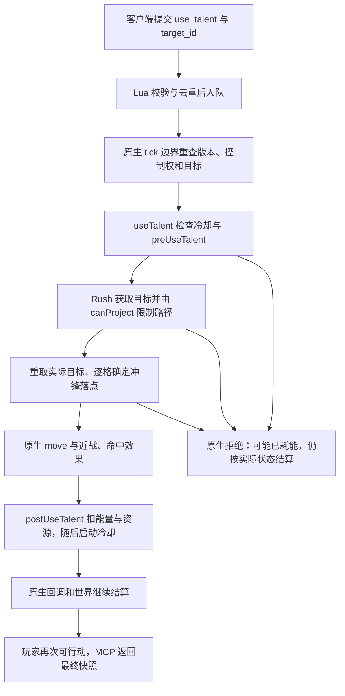

# Rush 释放流程与 MCP 架构改进方案

日期：2026-09-15。分析基线为 ToME 1.7.6 与 MCP Bridge/Python **0.4.0**。本轮按用户要求委派两名子代理分别追踪原生技能流程和审阅桥接架构，再交叉核对结论；仅新增分析文档，未修改运行代码、版本或存档。

配套分析：[原生完整流程](tome-mcp-rush-native-analysis.md)、[架构审阅与验收矩阵](tome-mcp-rush-architecture-analysis.md)。

## 1. 结论

**Rush 的直接阻塞是 Lua 技能白名单缺项。现有 `use_talent + target_id` 足以表达普通 Rush 的单次选敌意图，现有原生结算框架也能承接位移后的世界回合。** 不需要先新增一个专用 `rush` 工具或开放任意 Lua/UI 回调。

但安全交付不能只增加一个 ID：需要审核 Rush 使用的目标、路径、动态属性及变体，补齐普通技能的部分异常处理，并实际验证命令去重、原生耗时和真实落点。随后再把这些规则整理成可复用的技能适配描述，按目标形式逐步扩展。

### 本轮直接核验

- Python `TalentAction(type="use_talent", talent_id="T_RUSH", target_id=...)` 正常通过模型验证；见 [server.py](../server/src/tome_mcp/server.py:45)。
- 同样的请求交给当前 Lua `Actions.validate`，实际返回 `nil, unsupported_talent`；拒绝发生在入队与调用原生技能之前。见 [Actions.lua](../overload/mod/mcp_bridge/Actions.lua:123)。
- 用纯内存替身经现有 `Actions.execute(wait)` 的共用调用分支，令回调先改变位置、扣除 500 能量再抛错：返回 `execution_error` 和 500 耗能，但没有 `uncertain` 或 `native_message`。它证明当前共用错误分支的结果形状，不是真实 Rush 或真实存档场景。
- 0.4.0 已验证 Rush 学习、学习后的冷却和保存重载；这些证据不包含主动释放。见 [成长验收](../tests/growth/VALIDATION.md)。

前三项是无游戏运行的模块级检查。本报告的原生释放行为来自本地源码分析；没有将推导或内存替身写成新的 Rush 原生实测结果。

## 2. 完整释放链路



### 2.1 提交与前置检查

`tome.act` 校验动作后，以完整动作和 `expected_revision` 计算指纹，重复命令返回原记录；新命令在 `onTickEnd` 执行时再次检查控制权、版本、当前角色/场景及可见目标。当前普通技能调用形式是：

```lua
player:useTalent(talent_id, nil, nil, nil, target, nil, true)
```

这里的 `target` 用于回答原生选目标过程；没有设置忽略冷却、强制等级或忽略资源。最后的 `true` 只跳过已由动作请求确认的技能使用确认框。依据：[Runtime 执行入口](../overload/mod/mcp_bridge/Runtime.lua:276)、[Actions 原生调用](../overload/mod/mcp_bridge/Actions.lua:163)。

原生 `useTalent` 建立技能协程，先检查冷却，再运行 `preUseTalent`。后者不仅判断资源和睡眠等状态，还可能执行钩子和混乱等随机失败；某些失败会消耗回合或改变状态。Rush 自身的 `on_pre_use` 检查 `never_move`。因此 observe/inspect 不应调用此流程来预测是否可释放，也不能把所有失败都归为“什么都没发生”。依据：[ActorTalents](../../../../game/engines/default/engine/interface/ActorTalents.lua:141)、[preUseTalent](../../../../game/modules/tome/class/Actor.lua:5742)、[Rush](../../../../game/modules/tome/data/talents/techniques/combat-techniques.lua:23)。

### 2.2 选定目标并不锁定最终受击者

原生 Rush 调用 `getTalentTarget → getTargetLimited`。`getTargetLimited` 取得坐标后调用 `canProject`，受范围和阻挡限制，再从限制后的格子重新查找角色；它不直接采用传入的目标对象作为最终受击者。中途角色可能改变实际目标；墙角、地形或距离不足可能使技能拒绝。

随后 Rush 沿路径逐格检查，确定实际目标前可站立的落点；已有角色的最终位置由原生移动与回调决定。MCP 应保留此流程，不自行寻路到目标旁再补一次普通攻击。依据：[getTargetLimited](../../../../game/engines/default/engine/interface/ActorProject.lua:384)、[Rush 路径与移动](../../../../game/modules/tome/data/talents/techniques/combat-techniques.lua:48)。

现有 `force_target` 会临时替换整个 `Player:getTarget`。原方法还有玩家特有规则，例如 encased 状态的目标重定向，不能把它等同于单纯的鼠标点击输入。**标准 Frozen 同时设置 `never_move`，Rush 会在前置检查拒绝；本轮没有证明冰冻角色能违规冲锋。** 对特殊状态、被插件修改的玩家方法以及未来其他技能，需要明确目标策略与验证。依据：[force_target](../../../../game/engines/default/engine/interface/ActorTalents.lua:152)、[Player:getTarget](../../../../game/modules/tome/class/Player.lua:870)、[Frozen](../../../../game/modules/tome/data/timed_effects/physical.lua:760)。

### 2.3 位移、攻击、消耗和完成

Rush 使用原生 `move(tx, ty, true)`，再在仍与实际目标相邻时调用 `attackTarget(..., 1.2, true)`；命中且原生免疫检查允许时，请求施加基础 3 回合 Daze。移位、攻击、伤害和效果均可能触发其他原生回调。技能返回成功不保证攻击命中或造成固定伤害，也不能仅据返回值认定角色落在预计格。

成功后 `postUseTalent` 扣除技能耗能及资源、执行后置回调，再启动冷却。Rush 的原生速度类型为 weapon；耗能取决于 `getTalentSpeed`，不能固定写成 1000。基础 stamina 常规分支为 22，但会受资源修正、疲劳、Steamroller 或 hate 转换分支影响，不能把 22 当作最终费用。依据：[技能速度](../../../../game/modules/tome/class/Actor.lua:6286)、[postUseTalent](../../../../game/modules/tome/class/Actor.lua:6328)、[资源扣除](../../../../game/modules/tome/class/Actor.lua:6487)。

MCP 之后仍需等待原生 tick 返回、待处理回调完成、玩家重新可行动，再返回快照。当前 Runtime 已有这个稳定边界，位移技能可以复用；无需把 Rush 拆成多条移动命令。这个完成语义表示当前动作已经推进到下一决策点，不保证未来所有持续效果或飞行投射物都已结束。依据：[Runtime settle](../overload/mod/mcp_bridge/Runtime.lua:253)。

## 3. 架构缺口与处理优先级

| 当前情况 | 影响 | 建议 |
| --- | --- | --- |
| Rush 已在成长适配中，但未在执行白名单中 | 可学、可存档，不能主动释放 | P0 增加经过审核的 Rush actor 适配，复用现有 action schema |
| 通用技能 `pcall` 异常只返回 `execution_error/error`，没有 `uncertain` | 先位移/造成伤害再出错时，没有可靠接上现有写入隔离；原生错误文本也未沿 `native_message` 返回 | P0 统一普通动作与成长/物品的异常结果，保留已发生状态与已知耗能，禁止自动重放 |
| `target_id` 被当成唯一目标描述，未显式描述原生重定向/截断语义 | 客户端可能把选定对象当成保证受击对象，或自行补偿落点 | P0 写清 Rush 的目标语义；P1 将输入目标策略纳入技能适配描述。最终位置以现有快照为准 |
| 审核集中在 action/target/on_pre_use，动态范围、冷却、费用和相关方法未统一纳入适配规则 | 新技能/变体容易遗漏依赖；查询很难提供可靠信息 | P1 分离技能适配描述、纯元数据读取和原生执行，审核完整依赖与支持范围 |
| 学习支持、激活支持、当下能否尝试分布在不同响应中 | “supported” 容易被调用方误解为所有行为可用 | P1 保留现有字段，兼容增加明确的学习/激活支持、可接受动作形式及未知原因 |
| `self/actor` 之外的输入尚无正式契约 | 坐标、方向、持续技能和多次选择不能可靠扩展 | P2/P3 按具体目标和生命周期类型增加，不以通配白名单开放 |

通用异常缺口的直接依据是 [Actions 的 catch 分支](../overload/mod/mcp_bridge/Actions.lua:196) 与 [Runtime 的 uncertain 分支](../overload/mod/mcp_bridge/Runtime.lua:310)。这是源码中可确认的不一致；尚未在本轮真实游戏里注入 Rush 异常。

现有快照已经返回真实玩家坐标、资源、冷却和可见日志，不能说这些观测能力缺失。改进重点是解释输入/结果的关系，以及将原生失败和部分异常关联到同一命令，而不是重复建立一套世界状态。

## 4. 推荐实施顺序

### P0：交付标准 Rush

沿用请求形式：

```json
{"type":"use_talent","talent_id":"T_RUSH","target_id":"当前快照中的角色ID"}
```

具体范围：

1. 添加经过审核的标准 Rush 适配、能力发现和说明；核对目标/动作/前置/范围/冷却/费用及所用原生方法。特殊或修改后的定义明确拒绝或另列审核范围。
2. 保留原生 `useTalent` 全链路，只提供已经解析并验证的目标意图；明确目前支持的玩家目标策略。
3. 统一同步原生调用期间捕获异常的 `uncertain`、有界消息和隔离行为；原生正常拒绝仍保持实际耗能及世界结算。将来技能挂起后再由目标/对话回调恢复的错误，不能仅靠首次 `Actions.pcall` 处理，需要 P3 的命令归属设计。
4. 保留原有去重、租约、只读、stop、保存重载和 BC 交接；执行后使用新快照重新规划。
5. 用下节原生矩阵验收后才发布。当前 0.4.0 的成长测试不能代替这些释放测试。

### P1：让后续技能接入有共同规则

建立一份可复用的技能适配描述：技能 ID 和来源、允许的目标输入、所需原生方法、动态字段读取规则、变体条件、同步/交互类型及结果语义。将执行能力与纯查询从这份描述生成，避免每新增技能都分别修改多处名单和说明。

这不是根据 `target.type` 自动信任所有技能。单次 actor、自身、方向、坐标分别需要可审查的执行策略；技能内部再选目标、开对话或改写自身状态的行为必须单独审核。

查询保持纯度。`getTalentRange` 可调用动态函数，`getTalentTarget` 会计算动态定义并写 `talent_mode`，完整描述和 preUse 更可能触发状态或 RNG；不能直接用于 observe。对已审核、依赖可纯读的公式提供有来源的范围/费用说明，其余返回 unknown。当前是否可尝试也不作命中、路径或最终耗费的保证。

### P2/P3：扩展其他技能类型

- **方向/坐标：** 加入有界、明确作用的目标形式，同时保留现有 `target_id` 兼容；拒绝同一请求混用多种目标，不暴露隐藏实体。
- **持续技能：** 明确期望启用/关闭状态，避免把所有技能都按一次 activated action 处理。
- **多阶段选择：** 先设计命令拥有的交互状态和 continuation ID，再支持具体已审核的目标/选项。一个 `force_target` 会给每次 `getTarget` 重复同一答案，不能表达多阶段技能。
- **生命周期：** 区分仍在等待输入的命令和交还人工的终态；响应、取消、手动接管、断线、保存和错误都须有明确归属与清理规则。当前 `needs_input` 仍按既有人工交还语义处理，不偷偷复用为可恢复远程任务。

这些长期能力不应成为普通 Rush 的前置工程。也不应为了支持它们而暴露任意函数名、Lua 或 UI callback。

## 5. 发布前需要的原生验收

| 场景 | 必须核对 |
| --- | --- |
| 普通合法 Rush | 原生目标与落点、武器攻击、资源、实际能量、冷却、敌人回合及 ready 边界 |
| 相邻、超距、墙、墙角和路径阻挡 | 原生拒绝或截断行为，不穿墙、不人工绕路；中途角色保持原生处理 |
| 冷却、资源不足、never_move、睡眠、混乱 | 前置流程只执行一次；正常拒绝与会耗能的失败分开记录 |
| 命中、未命中、免疫、目标在回调中变化 | completed 不冒充保证命中；返回真实可见快照，无隐藏信息泄漏 |
| 移动/攻击/后置回调部分变更后异常 | uncertain、已知消耗、租约撤销、写入隔离；只读和原命令查询继续可用 |
| 重复命令、参数冲突、断线重连、排队 stop | 不重复位移、扣费、攻击；旧 revision/目标/session 正确拒绝 |
| 纯只读检查与插件互操作 | 不调用 RNG/感知/技能预检；BC/Danger 保持现有交接行为 |
| 自然角色与正式包 | 复制已记录来源，真实学习或读取已学 Rush 后施放；最后保存重载，保留原始证据 |

特殊状态和 Steamroller/hate 等变体若宣称支持，应单独验收；没有覆盖的变体明确限制。源码和安装包需要绑定同一冻结输入。下一步实施应以这份范围和矩阵为依据，而不是将“去掉 unsupported_talent”当成完成标准。
