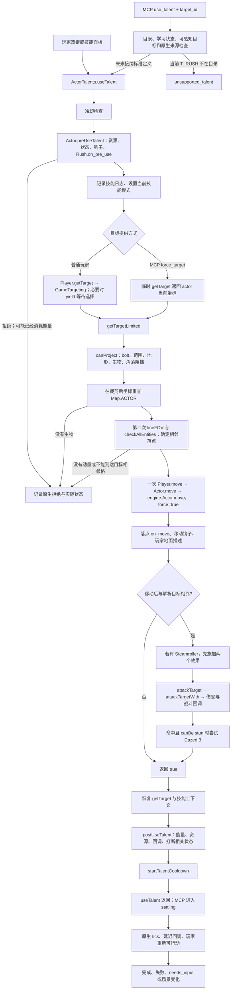

# Rush 原生释放链与 MCP 最小适配分析

日期：2026-09-15。范围：当前工作区源码；本轮只分析、编写本文，没有修改生产代码、版本、存档或运行战役。检索工作区及父目录未发现适用的 `AGENTS.md`。

## 1. 结论与证据等级

**当前不能通过 MCP 释放标准 Rush 的直接原因，是 `T_RUSH` 没有进入 Lua `Actions` 的技能目录。现有 actor 目标适配已经具备驱动标准 Rush 的调用形状。**

| 结论 | 证据等级 | 依据 |
| --- | --- | --- |
| 请求在技能目录检查处被拒绝，尚未进入原生 Rush | 源码证明 | [Actions.lua:6](../overload/mod/mcp_bridge/Actions.lua:6) 没有 `T_RUSH`；[validate:123](../overload/mod/mcp_bridge/Actions.lua:123) 返回 `unsupported_talent` |
| 标准 Rush 能消费现有 `useTalent(id,nil,nil,nil,actor,nil,true)` 提供的目标 | 源码证明调用链兼容；尚无真实释放验收 | [Actions.execute:193](../overload/mod/mcp_bridge/Actions.lua:193)、[useTalent:158](../../../../game/engines/default/engine/interface/ActorTalents.lua:158)、[Rush.action:49](../../../../game/modules/tome/data/talents/techniques/combat-techniques.lua:49) |
| 标准 Rush 本体无需多目标、地点选择、物品选择或通用 UI 回调 | 源码证明本体结构 | 只有一次 `getTargetLimited`，随后完成路径检查、一次移动、攻击并返回；无本体 `yield`、对话或 `post_action` |
| 加一条目录配置即可令当前结构审核接纳标准定义 | 源码推导 | activated 默认值、同源 action/target/on_pre_use、requires_target、无 post_action 均满足 [audit:63](../overload/mod/mcp_bridge/Actions.lua:63) |
| 加目录项就能保证任何角色、装备、附加组件与异常状态下都正确完成 | **未证明** | 共享移动、战斗、效果、结算链有钩子、对话与延迟回调；当前审核不覆盖全部传递调用 |

因此应先做受限的标准 Rush 适配与原生验收。目标生命周期、错误后部分执行等是现有通用执行器需要明确的契约，不能因为 Rush 暂时不在目录就推导出必须先建设通用 UI 自动化。

## 2. 技能身份与继承关系

标准定义在 [combat-techniques.lua:23](../../../../game/modules/tome/data/talents/techniques/combat-techniques.lua:23)，属于 `technique/combat-techniques-active`。`newTalent` 把名字规范化为 `RUSH`，缺省模式设为 `activated`，见 [ActorTalents.lua:65](../../../../game/engines/default/engine/interface/ActorTalents.lua:65)。当前 `game/` 内只发现这一处 `name = "Rush"` 定义；没有发现 `rushTarget` 或 `rush_target` 实现，不能在流程图里虚构这个公共函数。

玩家继承 ToME Actor，并混入玩家热键接口，见 [Player.lua:39](../../../../game/modules/tome/class/Player.lua:39)。ToME Actor 继承引擎 Actor，并混入 ActorTalents、ActorProject、Combat，见 [Actor.lua:47](../../../../game/modules/tome/class/Actor.lua:47)。因此实际分工是：

- `useTalent`：引擎 `ActorTalents`。
- `preUseTalent/postUseTalent`、技能速度与冷却：ToME `Actor`。
- `getTarget`、`lineFOV`、最外层 `move`：ToME `Player`。
- `getTargetLimited/canProject`：引擎 `ActorProject`。
- `attackTarget/attackTargetWith`：ToME `Combat`。

NPC 同样继承 ToME Actor，但有自己的 [getTarget:423](../../../../game/modules/tome/class/NPC.lua:423) 和 [lineFOV:162](../../../../game/modules/tome/class/NPC.lua:162)。NPC 会用 AI 目标；Rush 的 `on_pre_use_ai` 检查距离大于 1。它不能代替玩家路径验收，也不是 MCP 玩家释放必须调用的前置函数。

## 3. 完整流程图



图中正常失败分支回到执行器结算；Lua 错误、共享回调弹窗与死亡可以在多个节点发生。任何这些分支都不能解释为事务回滚。

## 4. 从输入到 Rush.action

### 4.1 普通玩家与 MCP 的入口

热键的 [hotkeyTalent:177](../../../../game/engines/default/engine/interface/PlayerHotkeys.lua:177) 和技能面板 [UseTalents.lua:231](../../../../game/modules/tome/dialogs/UseTalents.lua:231) 都调用 `actor:useTalent(id)`。

MCP 已有调用：

```lua
player:useTalent(action.talent_id, nil, nil, nil, target, nil, true)
```

这些参数分别意味着使用当前 actor、不改技能等级、不忽略冷却、提供目标、不静默，以及跳过 `useTalent` 顶层的技能使用确认。它不是 `forceUseTalent`，也没有注入忽略资源或忽略能量属性。调用前仍由 [Actions.execute:180](../overload/mod/mcp_bridge/Actions.lua:180) 检查已学习状态与目录审核。目标由 [Runtime.execute:289](../overload/mod/mcp_bridge/Runtime.lua:289) 在实际执行时解析，感知检查见 [Observer.visible:23](../overload/mod/mcp_bridge/Observer.lua:23)。

`no_confirm=true` 仅绕过 [ActorTalents.lua:328](../../../../game/engines/default/engine/interface/ActorTalents.lua:328) 的顶层确认，不能禁止技能内部或共享回调产生其他对话。

### 4.2 useTalent 的前后顺序

[ActorTalents.useTalent:141](../../../../game/engines/default/engine/interface/ActorTalents.lua:141) 对 activated 技能执行：

1. 冷却检查，不通过直接返回 false。
2. 创建 action 协程，调用 `preUseTalent`。
3. 记录技能消息，设置当前技能模式。
4. `prepareUse` 安装临时目标提供函数。
5. `xpcall` 执行 `ab.action`。
6. 恢复旧 `getTarget`，清理技能模式；若 action 抛错，转入原生错误报告并重新抛出。
7. `postUseTalent` 接受本次返回值后，再启动冷却、执行存在的 `post_action`，最后返回原生结果。

“rushes out”的日志早于目标和路径检查，见 [ActorTalents.lua:182](../../../../game/engines/default/engine/interface/ActorTalents.lua:182)。单看这条日志不能证明发生了移动或攻击。

### 4.3 原生前置检查仍然重要

[Actor.preUseTalent:5742](../../../../game/modules/tome/class/Actor.lua:5742) 涵盖禁用技能、恐惧、睡眠、能量、资源等检查；资源取动态 cost、cost_factor 和 `alterTalentCost`，见 [5835](../../../../game/modules/tome/class/Actor.lua:5835)。随后执行通用 hook 和 `callbackOnTalentPre`，见 [5946](../../../../game/modules/tome/class/Actor.lua:5946)。

Rush 自己的 [on_pre_use:39](../../../../game/modules/tome/data/talents/techniques/combat-techniques.lua:39) 只检查 `never_move`；它由 [Actor.lua:6002](../../../../game/modules/tome/class/Actor.lua:6002) 调用。没有额外的双手武器门槛，原生最终攻击会根据现有武器/徒手能力选择攻击方式。

**前置失败不等于零成本。** 混乱、技能失败概率、Fumble 可以先耗能后返回 false，见 [Actor.lua:5951](../../../../game/modules/tome/class/Actor.lua:5951)。Sentinel 还能先写技能冷却、触发攻击、耗能，再返回 false，见 [5990](../../../../game/modules/tome/class/Actor.lua:5990)。MCP 应保留实际能量变化并等待原生结算，不能在 false 后自动重试。

## 5. 目标、射线与落点

### 5.1 普通选目标协程与 force_target

普通 `Player:getTarget` 最终调用 [GameTargeting.targetGetForPlayer:299](../../../../game/engines/default/engine/interface/GameTargeting.lua:299)：进入 exclusive 目标模式并 `coroutine.yield()`；确定或取消目标后，由 [targetMode:120](../../../../game/engines/default/engine/interface/GameTargeting.lua:120) 恢复对应协程，传回坐标与生物。

MCP 的 `force_target` 在 [ActorTalents.lua:158](../../../../game/engines/default/engine/interface/ActorTalents.lua:158) 暂时替换 `who.getTarget`，直接返回 `force_target.x, force_target.y, force_target`。Rush 只有这一次目标请求，因此普通场景无需打开目标 UI。

这项替换也覆盖了 `Player.getTarget` 内的规则。例如 [Player.lua:870](../../../../game/modules/tome/class/Player.lua:870) 在 `encased_in_ice/encased` 时把选择限制为自身。应把这视为直接目标注入的语义边界，后续受限适配可选择对这些状态拒绝执行，或通过更低层的目标提供边界保留原生玩家逻辑。

但**不能据此声称正常 Frozen 已能通过 MCP Rush 逃脱**：[Frozen.activate:761](../../../../game/modules/tome/data/timed_effects/physical.lua:761) 同时施加 `encased_in_ice` 和 `never_move`；通常原生前置链已在 Rush.on_pre_use 拒绝。这里只证明存在被覆盖的目标规则，特殊状态组合与覆盖实现需要单独验证。

### 5.2 目标配置并不等于固定目的地

[Rush.target:37](../../../../game/modules/tome/data/talents/techniques/combat-techniques.lua:37) 返回：

```lua
{type="bolt", range=self:getTalentRange(t), requires_knowledge=false, stop__block=true}
```

范围函数按技能等级缩放，取整且上限 14；`6` 和 `10` 是缩放参数，最终范围由原生 getter 计算。[getTalentTarget:1063](../../../../game/engines/default/engine/interface/ActorTalents.lua:1063) 还设置技能模式。

注意字段拼写：本定义写的是 `stop__block`，而引擎阻挡规则读取 `stop_block`。当前仍会阻挡，是因为 [Target.types_def.bolt:629](../../../../game/engines/default/engine/Target.lua:629) 默认设置 `stop_block=true`，并且 [Target.getType:679](../../../../game/engines/default/engine/Target.lua:679) 默认 `actorblock=true`。适配器不能把这个额外字段误读成穿越阻挡，也不需要在本轮修正原生技能文件。

[getTargetLimited:384](../../../../game/engines/default/engine/interface/ActorProject.lua:384) 做了关键转换：

1. 从 `getTarget` **只取坐标**，不保留第三个 actor 返回值。
2. 通过 `canProject` 获取被范围/阻挡裁剪后的坐标；并不要求其 `is_hit` 返回值为 true。
3. 在裁剪后的坐标重新读取 `Map.ACTOR`，作为 Rush.action 中的 `target`。

所以请求远处敌人 A，路径上若先碰到生物 B，原生可能把 B 解析成 Rush 目标。它也可能裁剪到没有生物的墙或边界，从而拒绝。MCP 的 `target_id` 在这里表示**瞄准请求**，不保证最终攻击对象就是该 ID。

[canProject:286](../../../../game/engines/default/engine/interface/ActorProject.lua:286) 使用目标规则和 `Player.lineFOV`，计算角落、射程和停止格。具体规则见 [Target.block_path:487](../../../../game/engines/default/engine/Target.lua:487)：边界、范围、地形及 pass_projectile、阻挡实体与 actorblock 等。`requires_knowledge=false` 不是 MCP 获得隐藏敌人 ID 的许可；请求仍必须经过现有感知边界。

### 5.3 第二次检查真正的移动路径

Rush 取得解析后的生物后，另建带地形 `block_move(self)` 的 `lineFOV`，逐格调用 `checkAllEntities(...,"block_move",self)`，见 [Rush.action:52](../../../../game/modules/tome/data/talents/techniques/combat-techniques.lua:52)。这个循环只做路径检查，记录阻挡之前的最后一个可通行格。

原生随后要求：存在落点、从原位置到落点有至少一格移动、落点与解析后的目标坐标不超过一格。相邻目标通常不能积累动量；墙/角落/其他障碍导致无法到达相邻落点也会拒绝。具体斜线与角落行为依赖 `core.fov.line`，应在真实引擎中验收，不能用曼哈顿距离或自制寻路替代。

玩家射线实现见 [Player.lineFOV:757](../../../../game/modules/tome/class/Player.lua:757)。普通门在 `act` 未开启的检查中返回阻挡，见 [Grid.block_move:89](../../../../game/modules/tome/class/Grid.lua:89)。因此标准路径检查不会帮 Rush 打开关闭的门。

## 6. 移动、攻击与副作用

### 6.1 路径只检查，真正移动只有一次

Rush 在 [67](../../../../game/modules/tome/data/talents/techniques/combat-techniques.lua:67) 调用 `self:move(tx,ty,true)`，不是沿途多次普通移动。链条是：

- [Player.move:312](../../../../game/modules/tome/class/Player.lua:312)：调用 Actor.move，成功后更新视野位置、walked 标记、地面描述等。
- [Actor.move:1388](../../../../game/modules/tome/class/Actor.lua:1388)：`force=true` 跳过普通移动的混乱、睡眠、never_move 等分支及普通走路能量消耗；Rush 的移动限制依靠此前的技能前置检查和路径检查。
- [engine.Actor.move:229](../../../../game/engines/default/engine/Actor.lua:229)：更新地图中的 actor 和坐标，然后调用落点的 `on_move(self,force)`。
- ToME Actor 后续仍可运行诅咒物品、Body of Stone 等逻辑，以及 [callbackOnMove/Actor:move hook:1519](../../../../game/modules/tome/class/Actor.lua:1519)。

`force=true` 是原生 Rush 自己使用的移动方式。MCP 应调用整个技能，不能自己写坐标，也不能用若干 `move` 加 `attack` 拼装；后者会改变沿途触发、行动成本和一次技能事件的语义。

Rush 没有检查 `move` 的返回值。引擎的移动返回值本身也表示“尝试了移动”，不是可靠的成功到达凭证，见 [engine.Actor.lua:228](../../../../game/engines/default/engine/Actor.lua:228)。应观察实际坐标和后续结果。

### 6.2 移动后的攻击是原生完整近战链

[Rush.action:73](../../../../game/modules/tome/data/talents/techniques/combat-techniques.lua:73) 重新按移动后的实际坐标检查与 `target` 的距离。相邻时：

1. 若知道 Steamroller，先给目标施加 `EFF_STEAMROLLER`，给自身施加 `EFF_STEAMROLLER_USER`；这发生在命中判断之前。
2. 调用 `attackTarget(target,nil,1.2,true)`。
3. 只有攻击返回命中且 `target:canBe("stun")` 通过，才调用 `setEffect(EFF_DAZED,3,{})`。

[Combat.attackTarget:93](../../../../game/modules/tome/class/interface/Combat.lua:93) 处理恐惧/惊恐、潜行、攻击钩子、主副手或徒手、声音、顺劈等；[attackTargetWith:380](../../../../game/modules/tome/class/interface/Combat.lua:380) 处理武器资源、命中、防御、护甲、暴击、伤害类型转换、投射伤害与命中触发。`1.2` 是传给这条链的伤害倍率，不能当作最终伤害值。

`noenergy=true` 使这次近战不在 [Combat.lua:239](../../../../game/modules/tome/class/interface/Combat.lua:239) 再扣普通攻击能量，技能本身稍后统一结算。命中回调、装备触发、反击等仍然执行，见 [Combat.lua:669](../../../../game/modules/tome/class/interface/Combat.lua:669) 与 [1144](../../../../game/modules/tome/class/interface/Combat.lua:1144)。

Daze 的 `3` 是原始申请持续时间：未传 `apply_power`，所以不会进行该参数驱动的保存检定，但 `canBe("stun")`、通用效果拒绝/持续时间调整/回调仍然存在，见 [Actor.lua:7651](../../../../game/modules/tome/class/Actor.lua:7651)、[ActorTemporaryEffects.setEffect:117](../../../../game/engines/default/engine/interface/ActorTemporaryEffects.lua:117)。不能承诺每次 Rush 都让目标实际保留三回合 Dazed。

### 6.3 Steamroller 与延迟结算

[STEAMROLLER.activate:2670](../../../../game/modules/tome/data/timed_effects/physical.lua:2670) 把 `reset_rush_on_death` 绑定到施法者。目标死亡时，[Actor.die:3363](../../../../game/modules/tome/class/Actor.lua:3363) 注册 tick-end 回调，在稍后减少 Rush 冷却。这使本次攻击当场击杀目标时，也能在技能随后启动冷却后再重置。

Steamroller 用户效果立即增伤，合并上限 100%，见 [physical.lua:2687](../../../../game/modules/tome/data/timed_effects/physical.lua:2687)。源码中它在攻击前施加，不能仅凭天赋说明把增伤时点解释为击杀后。

此外，战斗中 Roll With It 也会注册稍后的击退，见 [Combat.lua:1076](../../../../game/modules/tome/class/interface/Combat.lua:1076)。引擎 `onTickEndExecute` 每次处理当时取出的回调批次，回调新注册的函数可留到后续批次，见 [engine.Game.lua:321](../../../../game/engines/default/engine/Game.lua:321)。所以 `useTalent` 返回时的坐标、冷却与生命快照未必是最终决策边界。

**当前 Runtime 已经处理这项等待。** [nativePhase:53](../overload/mod/mcp_bridge/Runtime.lua:53) 在 `onTickEndExists()` 为真时保持 settling；[engine.Game.lua:364](../../../../game/engines/default/engine/Game.lua:364) 检查当前 tick-end 队列是否非空。配合原生 tick 返回和玩家重新 ready 的条件，现有完成框架可以复用。仍需真实验收确认 Rush/Steamroller 与该框架的集成结果；这也不代表未来持续效果或其他异步机制全部结束。

## 7. postUse、失败、取消与完成语义

### 7.1 正常结算顺序

Rush 在移动后，无论攻击未命中还是因回调改变位置而不再相邻，最终都会到 [85](../../../../game/modules/tome/data/talents/techniques/combat-techniques.lua:85) 返回 true。原生 [postUseTalent:6328](../../../../game/modules/tome/class/Actor.lua:6328) 只在返回值为真时进入正常结算：

1. 根据 `getTalentSpeed(ab) * game.energy_to_act` 扣能量，见 [6352](../../../../game/modules/tome/class/Actor.lua:6352)。Rush 的 technique 类型使用 weapon 速度，见 [getTalentSpeedType:6286](../../../../game/modules/tome/class/Actor.lua:6286)，**不是固定扣 1000**。
2. 通过原生资源循环计算并扣除本次成本，见 [6487](../../../../game/modules/tome/class/Actor.lua:6487)。Rush 默认 stamina 基础函数返回 22，Steamroller 返回 2；启用 `swap_combat_techniques_hate` 则基础 hate 为 6/1，见 [Rush:31](../../../../game/modules/tome/data/talents/techniques/combat-techniques.lua:31)。实际成本仍受原生成本因子、疲劳、减免与其他状态影响。
3. 调用 postUse 钩子、`callbackOnTalentPost`，处理 Burning Hex、潜行和相关状态打断，以及某些 tick-end 回调，见 [6520](../../../../game/modules/tome/class/Actor.lua:6520)。
4. `postUseTalent` 正常返回后，引擎启动冷却，见 [ActorTalents.lua:197](../../../../game/engines/default/engine/interface/ActorTalents.lua:197)。最终冷却由 [Actor.getTalentCooldown:6865](../../../../game/modules/tome/class/Actor.lua:6865) 和 [startTalentCooldown:6921](../../../../game/modules/tome/class/Actor.lua:6921) 计算，不能只用 Rush 的基础 cooldown 函数预测。

### 7.2 返回值与状态矩阵

| 分支 | 原生可见结果 | MCP 应如何解释 |
| --- | --- | --- |
| 不在目录、没学习、过期/不可感知目标 | 还未进入本次技能原生调用 | 适配/请求拒绝；不要宣称 Rush 内部失败 |
| 冷却、资源不足、正常 never_move 等拒绝 | useTalent 返回 false，通常无正常技能结算 | 记录原生拒绝；仍观察实际状态 |
| 混乱、Fumble、Sentinel 等前置失败 | 可耗能、受伤或获得冷却，再返回 false | 原生失败已消耗行动；等待结算，不自动重试 |
| 目标取消或路径不成立 | 原生返回 nil/false；没有正常 Rush postUse 扣费 | 与尚在等待输入区分；日志不证明执行成功 |
| Rush 移动后近战未命中/惊恐阻止攻击 | Rush 本体仍返回 true | 技能完成，攻击效果另行观察；仍正常扣费和冷却 |
| 移动回调改变场景/位置，攻击未发生 | 可能已经移动或产生其他副作用 | 不把 `action_complete` 解释成命中；确认场景与实际坐标 |
| 共享回调打开对话或挂起协程 | 初始调用可返回 nil，同时原生仍有待处理交互 | `needs_input` 是交还控制边界，不是可靠的最终失败收据 |
| action/移动/攻击/postUse/cooldown 抛错 | 错误之前的写入可能已经生效 | 明示结果不确定、保留命令去重，不重放/回滚技能 |
| Steamroller 击杀或其他延迟效果 | 首次返回后冷却/坐标仍可能改变 | 在原生完成边界验收，保留延迟事件语义 |

### 7.3 协程等待不是原生失败收据

[ActorTalents.lua:308](../../../../game/engines/default/engine/interface/ActorTalents.lua:308) 包装 action 协程；action yield 后，外层也 yield，`useTalent` 的即时返回值可能为 nil。`__talent_running` 在 resume 后及外层返回前都会清理，见 [316](../../../../game/engines/default/engine/interface/ActorTalents.lua:316)、[346](../../../../game/engines/default/engine/interface/ActorTalents.lua:346)，因此它不是可靠的“技能已完成”信号。

标准 Rush 配上直接目标没有本体目标等待，因而不需要为了它设计任意 UI 恢复协议。但传递调用仍可能打开对话。例如 Actor.move 的诅咒树选择会调用 [chooseCursedAuraTree:137](../../../../game/modules/tome/data/talents/cursed/cursed-aura.lua:137)；该实现会先排除附近可见敌人，因此不能断言普通对敌 Rush 必然弹窗，仅能证明共享移动链并非绝对无 UI。

当前 Runtime 在出现目标协程/对话时进入 `needs_input`，见 [nativePhase:38](../overload/mod/mcp_bridge/Runtime.lua:38) 与 [settle:259](../overload/mod/mcp_bridge/Runtime.lua:259)。它尚未给一个后来由人类继续完成的技能提供新的原生最终返回收据。后续支持多阶段技能时需要专门设计这一生命周期，不能通过从协议传入任意 Lua 回调来解决。

当前 `Actions.execute` 捕获异常后返回 `execution_error` 和即时能量差，见 [196](../overload/mod/mcp_bridge/Actions.lua:196)，没有像部分成长/物品路径那样设置 `uncertain`。而 Runtime 已有处理 `result.uncertain` 的机制，见 [321](../overload/mod/mcp_bridge/Runtime.lua:321)。这是应在实现阶段一并审视的通用异常契约，不能从 `energy_spent=0` 推断技能完全没有改变世界。

## 8. 相关变体与边界

| 相关内容 | 与标准 Rush 的关系 | 适配边界 |
| --- | --- | --- |
| Steamroller | 修改成本，在 Rush 内施加标记与增伤，死亡时延迟重置冷却 | 标准 Rush 原生调用应自然覆盖；需要真实 tick-end 验收 |
| Strider | [npcs.lua:3239](../../../../game/modules/tome/data/talents/misc/npcs.lua:3239) 被动降低包括 Rush 在内的技能冷却 | 不新增 Rush action，保留原生冷却计算 |
| Repulsion 刷新冷却逻辑 | [weaponshield.lua:271](../../../../game/modules/tome/data/talents/techniques/weaponshield.lua:271) 命中时清除 Rush 冷却 | 是其他技能的副作用，不意味着这些技能自动获准执行 |
| 职业、召唤物、思想形态中的 Rush | 职业开放同一 combat-techniques-active 树；召唤物 [summon-melee.lua:397](../../../../game/modules/tome/data/talents/gifts/summon-melee.lua:397) 和 [thought-forms.lua:323](../../../../game/modules/tome/data/talents/psionic/thought-forms.lua:323) 学习同一 `T_RUSH` | 玩家与 NPC 的目标/视线实现不同；不扩展到任意 actor 控制 |
| 冲锋靴 | [boots.lua:138](../../../../game/modules/tome/data/general/objects/egos/boots.lua:138) 通过 charmt 使用 `T_RUSH` | [Object.use:244](../../../../game/modules/tome/class/Object.lua:244) 临时技能等级、物品能量/冷却和原生资源豁免属于物品使用链；不能冒充已学习的 `use_talent T_RUSH` |
| Blood Rush | [bloodstained.lua:48](../../../../game/modules/tome/data/talents/cursed/bloodstained.lua:48) 是独立的 `T_BLOOD_RUSH`；hit/pass_terrain、teleportRandom、流血、不同成本与冷却 | 不是标准 Rush 的别名或继承；必须单独审核 |
| Rushing Claws | [npcs.lua:968](../../../../game/modules/tome/data/talents/misc/npcs.lua:968) 是独立的 `T_RUSHING_CLAWS`；独立路径循环和 pin 效果，没有标准 Rush 近战伤害链 | 不能仅凭名称相似自动纳入 |
| 其他描述含 Rush/冲向的技能 | 如 grapple/takedown、shadow、golem 等各有 action | 名称或战术 CLOSEIN 标签不是适配保证，不作为 `T_RUSH` 的传递实现 |

本轮检索范围是当前 `game/` 源码。运行时另装的 addon、superload、hook 或替换函数不因这份静态分析自动获得兼容保证。

## 9. 最小实现建议与必须验收的事项

### 9.1 可以保持现有架构的部分

标准请求仍然是：

```json
{"type":"use_talent","talent_id":"T_RUSH","target_id":"<本次观察中的生物 ID>"}
```

最小目录配置可用现有 `target='actor'` 和 `source='data/talents/techniques/combat-techniques.lua'`。能力清单、技能 inspect 和执行路径已由该目录贯通，不需要新的 `rush` 命令或从外部传坐标/Lua 函数。

目录说明应明确：瞄准一个当前可感知的生物；原生射线可能停在其他阻挡生物处；原生 Rush 执行路径、移动、120% 基础近战倍率与 Daze 尝试。`Actions.describe` 对动态成本返回 unknown 且 `costs_are_final=false`，见 [87](../overload/mod/mcp_bridge/Actions.lua:87)，符合当前只读查询边界；不能为了显示 Rush 射程/成本就随意调用带 hook 的计算函数。

### 9.2 实现前应明确的受限契约

1. **目标语义**：把 `target_id` 定义为 requested target；观察/日志里的实际命中者按原生与可感知事实记录。若未来增加 resolved target 字段，只能暴露当时可感知的信息，不能因射线碰到隐藏生物就泄漏其身份。
2. **直接目标策略**：为 `Player.getTarget` 被替换的规则确定边界。当前阶段可对 encased 状态保守拒绝；若要保留全部目标规则，设计经过审核的更低层目标提供方式并另行验收。不要把正常 Frozen 宣称为已证实漏洞。
3. **能力与可用性分离**：`supported=true` 只说明适配被审核且已学习，不承诺当前未冷却、资源足够、目标合法或路径可达。让一次原生 `useTalent` 决定实际执行，避免在 observe/inspect 重复调用 preUse、canProject 或 action。
4. **错误与待输入**：共享回调异常可能部分执行；利用现有 uncertain/隔离机制明确返回。意外 UI 交给人类并停止后续写入；不要自动点击确认或把 nil 统一看成可重试失败。
5. **边界结算**：保留 Runtime 排队、revision/lease、重复 command ID 和 settling。验收实际 tick-end 后的资源、位置、冷却；不要在 action 返回的瞬间宣称所有效果结算完毕。

这些要求中，目录项是直接修复点；目标注入语义、异常和待输入生命周期是应明确或加固的共用边界。无需借此扩张为通用技能脚本执行器、任意 UI 回调或无限技能白名单。

### 9.3 尚未执行的原生验收矩阵

以下是实现后的验收建议，**不是本轮已经通过的测试**。应使用独立测试存档/场景并固定可解释的角色配置；普通战役只适合后续兼容确认。

| 场景 | 必须核对的事实 |
| --- | --- |
| 平直无阻挡、合法距离、学习一级 Rush | 未进入目标 UI；移动至目标相邻格；原生调用完成；成本、能量、冷却与同配置手动释放一致 |
| 相邻目标、超出射程、墙、关门、窄斜角 | 原生拒绝/裁剪行为；没有适配器自行寻路、开门或改写坐标 |
| 请求 A、射线上 B 为敌人/友方 | 原生实际解析与攻击对象；请求与结果语义一致；不假定始终攻击 A |
| 执行前目标死亡、移动、消失或失去感知 | 在当前 revision 与实际执行边界重新判断；不使用旧坐标/旧 actor 句柄 |
| never_move、标准 Frozen、资源不足、已有冷却 | 原生检查保留；Frozen 应在普通前置链被阻断 |
| 混乱/Fumble/Sentinel 的确定性触发 | false 仍可能扣能量、受伤或进冷却；命令不重放，等待新决策边界 |
| 未命中、stun 免疫、伤害吸收 | 技能完成不等于造成伤害或 Daze；原生正常结算保留 |
| 不同武器速度、疲劳、hate 替代成本、Steamroller | 不写死 1000 能量/22 stamina；最终状态与原生计算一致 |
| Steamroller 当场击杀与后续回合击杀 | tick-end 冷却重置和增伤时点正确；completed 快照的边界没有抢在关键回调之前 |
| 落点 trap/on_move、移动钩子改位置、反击死亡 | 副作用执行一次；有死亡/场景变化时，结果不能伪装成单纯近战成功 |
| 共享回调打开对话或 yield | 转 needs_input、撤销控制；保留已发生变化；人类继续后不误发重复 Rush |
| 移动、攻击、postUse 或 cooldown 注入错误 | 确认部分执行时标记 uncertain，禁止自动重放，观察仍可读取 |
| 重复 command ID、断线重连、stale revision | 一个请求最多执行一次；已有结果可恢复；旧世界状态不能再次推进 |

验收结果应分别报告：适配是否接纳、原生 useTalent 是否完成、实际位移、攻击/效果观察、资源与能量变化、冷却及延迟回调、最终是否回到可决策状态。仅出现成功日志、非空返回或位置变化中的一项都不足以覆盖完整释放链。
