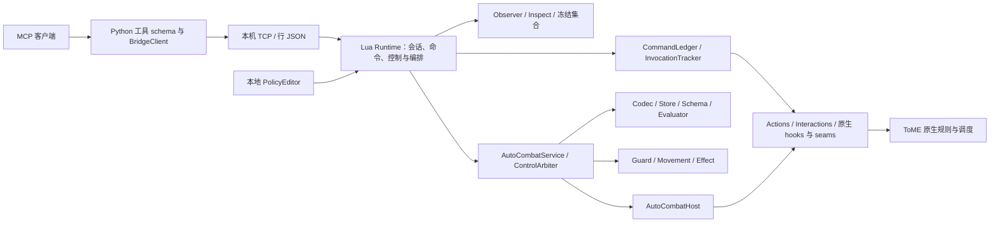

# ToME MCP Bridge 系统技术审核报告

日期：2026-09-22。审核对象：`main@caefa9a94af85dabd73c0d7e74ef764081b1fb3e`，产品 0.9.0 / 内部协议 v4。

## 1. 结论

**基础桥接的架构方向成立，已有较完整的能力和回归基础；项目尚未完整达成当前设计契约，不能用现有全绿测试证明已经完成。** 本轮结论为 `changes_required`，不是要求重写整个项目。

- **设计目标**：玩家视角观察、原生动作入口、命令账本、交互续接、数据策略和本地执行已有实现；自动战斗部分显式策略语义和控制上限没有兑现。高级人类编辑器与独立插件交付仍有范围差距。
- **架构**：游戏内 Lua + 游戏外 Python MCP 的边界合理；账本、观察集合、策略 codec/store/evaluator、原生缝隙生成器提供了有效模块边界。主要结构问题是 Runtime 承担多条入口的编排与持久化，本地/远程出现重复逻辑；自动战斗还依赖 Bridge Runtime 才能完整启动和编辑。
- **逻辑正确性**：已观察到具体反例，且部分现有测试把存在契约争议的行为作为预期结果。应优先修复高影响语义与控制边界，再做模块整理。

本报告不会把“没有本轮真机证据”写成运行必然失败，也不会把未复现的担忧列为代码缺陷。后续实施见[配套修改方案](tome-mcp-remediation-plan-2026-09-22.md)。

**去重结果：13 项，P0=0 / P1=5 / P2=6 / P3=2。** P1 中有三项运行语义/控制缺陷、一项预算契约分叉和一项强制验证门禁缺口。未发现 P0 不等于证明所有场景没有 P0。所有条目目前均 OPEN；本轮没有实施修复。

## 2. 基线、审核身份与方法

### 2.1 固定基线

| 项目 | 值 |
| --- | --- |
| 仓库 | `/workspace/t-engine4/game/addons/tome-mcp-bridge` |
| 分支 / commit | `main` / `caefa9a94af85dabd73c0d7e74ef764081b1fb3e` |
| 包 | `dist/tome-mcp-bridge.teaa` |
| 包 SHA-256 | `5b32c28ad639a652e6ab83fa3cf88a6badc1b49dbaf753e329f0937af77c75e2` |
| 起始 dirty overlay | 仅既有未跟踪 `docs/tome-mcp-token-usage-analysis.md`；未把它视为规范，未改动 |
| 原始证据根目录 | `/workspace/t-engine4/tmp/mcp-system-review-20260922` |
| 本轮产品变更 | 无；只交付审核/修改方案文档与模型执行记录 |

由三个全新、独立的 Codex 内置 `[Review]` 上下文分别审核协议/运行态、自动战斗、架构/目标/证据，模型均为 **GPT-5.6 Sol / high**。协调者负责固定基线、跑基线检查、复跑关键反例、核对证据并汇总。未派发 Dev/Test，不推进这两条模型轮换序列。

第一位协议审核代理因平台内容检查中止，没有产出报告；另派 fresh `protocol2` 完成该方向，不将中止任务计入审核覆盖。自包含派发简报、角色/权限、模型和报告地址保存在证据根目录。

### 2.2 当前规则与历史材料

以当前 [AGENTS.md](../AGENTS.md)、[自动战斗设计](tome-mcp-auto-combat-plugin-design.md) 正文 §0–16 和对应 API/协议契约核对实现。历史架构、v1/v3 设计和过往 PASS 是背景或证据声明，不自动成为当前规范。

本轮特别遵守以下边界：

1. 观察可以调用实时 getter/builder，也可以消耗 RNG；必须不提交动作、不泄露玩家未知信息。
2. 源码摘要和函数身份只能作重审提示，不能恢复为运行门禁。
3. 撤退、传送、休息、探索、换层都可以是合法策略；已知风险由策略阈值决定，插件只对无法正确执行的情况 fail closed。
4. 策略显式上限、控制仲裁、单次提交、pending 不重发和手动接管是执行模型要求。
5. 本轮只做静态追踪、生产模块最小复现、现有自动化检查与包字节核对；**没有启动 ToME 实机或长局游玩**。

## 3. 架构评估



这是现有代码职责关系的摘要，不代表所有引用都在模块加载时发生。静态字面 require 清单见 `dependencies.json`。

### 3.1 合理且应保留的部分

- **进程边界正确**：MCP 协议、stdio 与外部等待留在 Python，游戏结算留在 Lua/native；不让 LLM 生成期间阻塞游戏主线程。
- **有独立的纯逻辑模块**：CommandLedger、ObservationViews、PolicyCodec/Store、Evaluator、ControlArbiter 等可在受控输入下验证。它们比在 Runtime 内堆叠所有分支更容易审查。
- **动作结果有生命周期模型**：Actions/Tracker/Interactions 处理原生调用和续接；自动战斗能表达 native_pending，已设单次提交和失效代际机制。
- **策略用规范化数据保存**：运行策略使用私有 canonical bytes，避免调用方修改共享 Lua table 后静默改变已批准策略。
- **原生缝隙有生成与漂移检查**：当前三个生成器检查通过；当前包与源文件完全一致。该检查是开发期证据，不应变成函数身份运行门禁。

### 3.2 主要结构风险

- **本地/远程入口的策略写入职责重复**：已经导致 local clear 持久化漏项。这是应优先合并的真实责任重复，而不是仅按文件长度拆分。
- **Runtime 聚合责任较多**：当前文件 2,641 行，同时承接会话、TCP、命令生命周期、观察路由、原生交互、控制与自动战斗 host 构造。行数只是定位辅助；真正风险在于跨入口状态更新容易不同步。
- **自动战斗的独立部署边界尚未完成**：可无 MCP 客户端使用不等于可只安装 `tome-auto-combat`。UI/hooks 仍直接使用 `mod.mcp_bridge.Runtime`，构建只交付 bridge addon。
- **规范与验收材料缺少唯一的当前入口**：设计正文、修复轮契约和历史验收可能给出不同语义。测试若沿用其中一方的 oracle，即使全绿也不能解决规范冲突。

推荐渐进重构：先统一操作结果与持久化规则，再把 transport-free 本地运行服务和 MCP facade 分开；Json/Distance 等中性工具可进入共享层。保留现有原生动作和时序模型，避免在结构整理时重写结算逻辑。

## 4. 本轮执行的验证

| 检查 | 结果 | 证明范围 / 限制 |
| --- | --- | --- |
| `bash tests/run.sh` | PASS：43 个 Lua 测试脚本 | 单元/受控夹具回归；其中 ledger 有大循环断言，不能将约十万 checks 解释为十万独立场景 |
| `PYTHONPATH=server/src <isolated-python> -m unittest discover -s server/tests -v` | PASS：39 tests | 使用项目固定 `mcp==2.2.0`；包括受控 TCP peer 与 stdio/MCP 路径，不是 ToME 实机 |
| `generate_native_seams.py --check` | PASS | 当前生成输出与本地引擎源码对应 |
| `generate_effect_manifest.py --check` | PASS | 当前生成效果来源记录一致 |
| `generate_protocol.py --check` | PASS | 14 internal ops、共享 limits、错误注册表和相关 schema/向量检查；不是所有跨层行为证明 |
| `check_boundary_rules.py --check` | FAIL，exit 2 | 文件不存在，且 `tests/run.sh` 未调用；与 AGENTS 声明冲突 |
| `.teaa` / manifest / source parity | PASS：70/70 成员 | 哈希相同、没有额外/缺失成员；仅证明字节一致，不证明实机加载与行为 |
| 历史 M5 manifest 校验 | PASS：12 evidence 文件、6 gates | 文件哈希一致；其中 G-03/G-04 自身为 partial，不是当前版本全部门禁已通过 |
| 关键最小反例协调者复跑 | REPRODUCED | 策略预算/模式/连续上限、本地 clear、manifest 悬空引用及协议入口边界 |
| 本轮 source/dist 原生游戏验收 | NOT_OBSERVED | 未启动游戏；source/dist 模块测试不能替代原生验收 |

仓库没有 `server/.venv`，系统 Python 也未安装 MCP。为运行现有测试，本轮在证据根目录创建隔离 venv，仅安装项目指定依赖并以 `PYTHONPATH` 加载源码；依赖版本列表和命令均保留。环境未预装依赖不列为产品缺陷。

## 5. 设计目标达成度

“部分达成”表示目标包含尚未兑现的条款，不是估算完成百分比。

| 目标 | 当前判断 | 主要依据 |
| --- | --- | --- |
| 基础桥接：玩家视角观察与原生动作 | 已有完整生产链与广泛回归；仍需按具体反例整改 | Observer/Actions/Runtime/Interactions；读边界与动作结算分开；本轮无真机复验 |
| 基础桥接：幂等、串行、接管、保存隔离 | 关键机制成立，不能推广成所有异常路径已验证 | CommandLedger、InvocationTracker、控制 arbiter、保存白名单；直接 v4 请求的 public/internal 隔离及闭合校验仍有 SYS-11/12 |
| G1 单一策略真相 | 部分达成 | canonical bytes / draft-approved-running 分离正确；本地 clear 与保存副本分叉，人类导入 UI 不完整 |
| G2 人机双易用 | 部分达成 | AI JSON 与 preset 可用；现有 UI 只调有限字段，缺规则创作、导入和提案差异审阅 |
| G3 本地执行 | 实现路径达成 | hotkey→Runtime→Service/controller→host→Actions，无外部模型逐步驱动；默认执行授权仍关闭；本轮 native 未观察 |
| G4 可独立 | 部分达成 | 可不启动外部 MCP client/server；不能按规范只安装独立 auto-combat addon |
| G5 可接入 MCP | 主要能力达成 | `tome.policy` / `policy_log`、观察摘要、统一控制链已接通；错误表现仍须按协议审核结论修正 |
| G6 安全与忠实执行 | 部分达成 | 审核确认的数组/unknown/raised-spec/原生入口机制有价值，但连续动作上限与 emergency_only 明确未兑现 |
| G7 可验证与可回放 | 部分达成 | deterministic tie-break、dry-run、有界 log 和 trace replay 已有；缺完整输入/adapter版本/状态时不能声称确定性重新执行；验收证据链也不闭合 |

不把“任意职业/任意 mod 全覆盖”“无需人工完成整场战役”作为本版必须已实现的目标；这些本就不是当前有限能力目录能够保证的产品范围。

## 6. 确认的问题与证据

以下为去重后的稳定编号。原始审核编号保留，便于找到独立判断。问题分为运行行为、契约冲突、交付缺口和验证缺口，不能仅按数量判断运行风险。

### SYS-01 · P1 · 连续动作上限没有执行（AC-F3）

`PolicySchema.lua:115–117,416–425` 接受 `limits.max_consecutive_actions`，但 controller/service/Runtime 没有消费这个限制。`AutoCombat.lua:808–840` 增加并回报动作数，却不在下一次提交前检查此上限。

生产 controller + schema 的反例设置 cap=1，连续两个新机会都有有效规则，结果：

```text
CONSECUTIVE max=1 requests=2 actions=2 first=acted second=acted state=running
```

源码和解包 dist 结果一致。host 为受控替身，这证明生产调度器忽略了已接受的字段；不声称观察到真实游戏执行。影响是用户声明的整轮行动保险丝无效。应明确定义重置点，并在所有原生提交入口统一检查、到顶交回控制。

### SYS-02 · P1 · emergency_only 会隐式扩大到普通规则（AC-F2）

`PolicyEvaluator.lua:287–293,332–377` 在 emergency 规则被拒后构造普通规则 fallback，即使策略明确选择了 `mode.on_low_hp='emergency_only'`。与设计 §5.4 及 schema 注释冲突。

```text
EMERGENCY mode=emergency_only hp=30 requests=2 rules=heal,ordinary action=acted chosen=ordinary emergency=false fallback=true
```

该行为源于历史防活锁修复，当前测试有意要求它；因此不能简单恢复“pause 并持有 lease”的旧行为。应让 unavailable 后的普通 fallback 成为显式策略选择；严格 emergency_only 无可执行动作时 stop/release。问题在于执行器扩大策略允许集合，不在于攻击或撤退本身是否危险。

### SYS-03 · P1 · 动作预算存在两份冲突契约（AC-F1）

主设计 §4.1 要求所有真实调用尝试计入 `max_actions_per_tick`，`AutoCombat.lua:561–569,722–810` 则只计成功或实际耗能。后者由 [anor-reg-01 fix2 反馈](tome-mcp-0.9.0-anor-reg-01-fix2-feedback.md) 明确规定，用于解决 limit=1 的冻结活锁。

```text
BUDGET max=1 requests=2 rules=first,second attempts=1 action=acted chosen=second
```

**这是已合并行为与主规范未统一，不是无界循环。** 拒绝集合和 8 次循环仍限制提交。建议保留有效动作计数的修复，另行明确真实提交/拒绝上限，统一设计、字段语义、日志与测试；不能只补一次 `attempts++`。

### SYS-04 · P2 · 本地 clear 未同步持久化副本（AR-F02）

[Runtime.lua](../overload/mod/mcp_bridge/Runtime.lua#L2529) `2529–2538` 的本地操作写回列表遗漏 clear；远程分支 `1993–2018` 则包含它。生产 service/store/reset 复现：

```text
live_draft_after_clear=false
saved_draft_after_clear=true
draft_after_runtime_reload=true
```

该问题仅针对 `Runtime.autoCombatHandle(game,'clear',{})` 调用者。当前 UI 没有 clear 按钮，远程 MCP clear 也正确写回，不能扩大为全部用户清草稿都失败。建议把 mutation→persist 规则集中，并同时验证本地/远程保存和重载。

### SYS-05 · P1（验证门禁）· 承诺的边界检查未交付（AR-F01 / AC-F4）

[AGENTS.md](../AGENTS.md#L144) 声称 `tools/check_boundary_rules.py --check` 已接入 `tests/run.sh`。当前脚本不存在，测试入口没有调用；执行得到 exit 2 / No such file。历史 RA-07 仍 OPEN 的记录不能覆盖现行“已接入”声明。

此项是强制验收门禁失效，**不等于已经证明当前动作存在数组或 spec 错误**。两位独立审核者分别定为 P1/P2；综合报告采用架构审核的 P1 验证级别，以标明它阻塞当前强制门禁声明。必须恢复真实 checker 或明确修订契约；A/B 做可失败的结构检查，C/D/E 保持 REVIEW，不得打印虚假的语义 PASS。

### SYS-06 · P2 · manifest checker 接受悬空证据（AR-F05）

[verify_validation_manifest.py](../tools/verify_validation_manifest.py#L22) `22–49` 只校验顶层 evidence 文件，并只要求 passed gate 的 evidence 列表非空。反例顶层 evidence 为空，gate 引用不存在的文件，raw_sources 也缺失，仍输出：

```text
manifest check: OK (0 evidence files, 1 gates)
```

协调者复跑一致。它证明工具没有建立 gate→evidence 引用闭合；不证明既有 M5 summary 全部造假。应检查引用归属、文件/hash、唯一性和明确纳入证明范围的 raw/artifact 来源。

### SYS-07 · P2 · 当前候选缺少耐久验收索引（AR-F06）

`VALIDATION.md:1–22,79–94`、`docs/tome-mcp-model-performance.md:338–371` 和 `validation/` 未形成一个针对当前 70-member 包的完整候选索引。当前 raw 主要在 tmp，删除后仅从仓库不能复核同样的 source/dist 结论。

历史记录显示 `09753d3` / 同一 dist 曾做 probe 234/234、acceptance 101/101，当前基线相对它只改模型记录文档，因此这些材料与当前生产字节相关。**不能据此声称本轮新做了真机验收，也不能因归档不足否定既有实测。** 应保存小型候选 manifest、原始命令与耐久证据地址/hash，并标注可复用范围。

### SYS-08 · P2（目标缺口）· 人类编辑器尚未达到 G2（AR-F03）

`PolicyEditorModel.lua:98–126` / `ui/PolicyEditor.lua:68–165` 提供五个全局字段、规则 enabled/priority、preset、批准/激活和 JSON 显示。设计 §6 要求的规则/条件/动作创作、导入、diff/merge 和 AI proposal 审阅尚未接通。

影响是用户能微调预设，但不能通过设计承诺的人类工作流编写和审阅同一策略。应按里程碑补齐，或明确修订本版本目标；服务端已有 import 不等于 UI 导入完成。

### SYS-09 · P2（交付缺口）· 独立 auto-combat 包尚不存在（AR-F04）

`init.lua:1–12`、`hooks/load.lua:17–45`、`ui/PolicyEditor.lua:8` 和 `tools/package.py:24–50` 表明仅交付 `mcp-bridge` 一个 addon，UI/hook 依赖 Bridge Runtime。与设计 §3 / §9.3 的独立 `tome-auto-combat` 安装形态不符。

当前“无外部 MCP 进程”的本地能力值得保留；完成独立发行还需要不依赖 transport 的 host/facade、独立包入口和组合加载测试。不要复制第二套原生执行器来获得表面独立。

### SYS-10 · P3 · README 的协议与能力清单陈旧（AR-F07）

`README.md:5` 声明 v4，第 85 行仍说 v3；当前工具表遗漏 list/map/dismiss/abandon/policy/policy_log，且分页被写为后续工作。实现和 generator 已是 v4，不应把文档漂移误诊为协议未升级。应更新公共入口并把旧文档标为历史。

### SYS-11 · P1 · 公开 act 接受内部自动目标控制字段（SYSREV-P1-01）

[Actions.lua](../overload/mod/mcp_bridge/Actions.lua#L303) `303–372` 接受仅用于内部自动战斗的 `force_actor`、`force_grid`、`authoritative_target`、`sequence`；[Runtime.lua](../overload/mod/mcp_bridge/Runtime.lua#L2143) `2143–2190` 的公开 act 路径直接复用此验证器。

触发范围是**已认证、持控制 token 的直接 v4 TCP 请求**；Python MCP 的 StrictModel/TalentAction 已拒绝这些额外字段。生产 Runtime 离线请求复现：

```text
internal_fields_error=nil
internal_fields_status=queued
queued_authoritative=true
```

这证明请求已被接受并排队，没有执行真实 talent。后续内部语义会接管多次原生目标请求，与 README 的远程“一次性预填、后续通过 respond 处理”承诺不同。原生射程/结算守卫仍存在；本报告不把它描述为未经认证访问或外部攻击结论。

应隔离 public action DTO/validator 与内部 executor carrier；内部上下文参数不能从公开请求正文取得。Runtime 入站必须有拒绝回归，而不仅验证 Python Pydantic 会拒绝。

### SYS-12 · P2 · 实际入站校验与 v4 schema 不一致（SYSREV-P2-01）

`requests.schema.json:6–13,90–130` 要求闭合对象及 sections 数组；`Runtime.lua:1831–1835,1940–1956` 只检查最少字段，sections 检查为 table 后直接 ipairs。

传入 JSON object 形状的 sections，schema 判 invalid，Runtime 却无错误并返回完整 player/map；envelope/args 的未知键也被忽略。协调者复跑得到：

```text
malformed_sections_error=nil
malformed_sections_has_player=true
malformed_sections_has_map=true
extra_fields_error=nil
extra_fields_result=true
```

此例没有证明隐藏信息泄漏，证明的是畸形筛选退化成完整快照、闭合协议未实际执行。它也是 AGENTS 边界规则 A 的具体实例。应在真实入站边界落实按 op 的闭合校验，在任何 ipairs 前验证数组形状；从 JSON 文本经过 Transport 解码再进入 Runtime 做负例。

### SYS-13 · P3 · dismiss 自述提供了不合法的答案示例（SYSREV-P3-01）

`server.py:525–537` 描述 `{"type":"confirm","value":true}`，但 `server.py:71–104` 的 Answer 联合只接受 actor/position/direction/option/cancel，游戏侧也没有发布 confirm answer type。按工具自述调用会被 Pydantic 提前拒绝。

最小修复是改用实际 interaction 的 answer_types/options，删除错误示例；若要新增 confirm，应作为完整协议扩展同步双端，而不是只让 schema 放行。

## 7. 已核查正确的逻辑与结论边界

- **账本与传输**：生产分类在 lease/revision 检查前处理 command replay/conflict/gap/expired；Python write timeout 不自动重发，保留 ID 并让调用方查询 status。审查未发现这些抽样路径存在重复执行问题。
- **控制与 native_pending**：排队动作通过原生 tick 回调执行；pending 跟踪阻止再次提交；人工输入撤销 owner。controller/service 的同因停止和 generation 去重有精确回归。
- **观察与保存**：抽查 Observer/Items/LevelMap/Progression/Chat 使用 perception/identified 信息；读取未调用动作提交入口。运行态保存在模块 session/transport/ledger/tracker，持久化策略有独立白名单。未验证每种隐形、感知与第三方 addon 组合。
- **效果与移动**：已审 plan/target_plan/candidates 数组消费点有稠密闭合验证，raised spec 保留显式 false 与真实 callback；footprint 任一组件失败不会把部分 union 当完整结果。SYS-12 表明该原则尚未落实到全部公共输入。
- **策略数据**：draft/approved/running、canonical bytes、detached copy 和实时 getter 的处理符合当前方向；已有模块值得保留。

全绿测试与本轮反例并不矛盾：有的分支没有被覆盖（本地 clear、连续上限、公开/internal 隔离），有的测试明确锁定了与主规范分叉的行为（预算和 emergency fallback），有的检查只验证声明/哈希而不验证实际消费点（schema、manifest）。

本轮没有测原生长局、延迟/RSS、全部技能、所有自定义 UI、跨平台或其他 addon 的全面兼容；没有对全部 91 份文档作逐条认证。`max_candidates` 被 schema 接受但消费与候选定义仍需澄清，作为 **U-01 未定事项**进入方案，不混入已确认问题计数。

## 8. 去重台账与修改顺序

| 综合 ID | 独立来源 | 级别 / 类型 | 修改工作包 | 当前处置 |
| --- | --- | --- | --- | --- |
| SYS-01 | AC-F3 | P1 / 控制上限 | WP-2 | OPEN，未来 Dev 修复，Test+Review 验收 |
| SYS-02 | AC-F2 | P1 / 策略忠实性 | WP-0 → WP-2 | OPEN，先明确 unavailable 行为 |
| SYS-03 | AC-F1 | P1 / 契约冲突 | WP-0 → WP-2 | OPEN，保留防活锁要求并统一规范 |
| SYS-04 | AR-F02 | P2 / 本地持久化 | WP-3 | OPEN，生产入口对称回归 |
| SYS-05 | AR-F01 + AC-F4 | P1 / 验证门禁 | WP-4 | OPEN，不能继续声称已强制接入 |
| SYS-06 | AR-F05 | P2 / 证据工具 | WP-4 | OPEN，补引用完整性与负例 |
| SYS-07 | AR-F06 | P2 / 候选归档 | WP-4 | OPEN，发布前形成耐久索引 |
| SYS-08 | AR-F03 | P2 / 编辑器目标 | WP-6 | OPEN，分阶段交付或明确修订目标 |
| SYS-09 | AR-F04 | P2 / 独立发行目标 | WP-7 | OPEN，单包与组合加载验收 |
| SYS-10 | AR-F07 + SYSREV-P3-02 | P3 / README | WP-5 | OPEN，同步当前能力与 v4 |
| SYS-11 | SYSREV-P1-01 | P1 / 公开动作边界 | WP-1 | OPEN，区分外部字段与内部上下文 |
| SYS-12 | SYSREV-P2-01 | P2 / 入站校验 | WP-1 | OPEN，真实解码入口回归 |
| SYS-13 | SYSREV-P3-01 | P3 / 工具自述 | WP-5 | OPEN，示例必须通过真实 schema |

所有工作包目前由协调者维护待办，尚未派发实现。不能把写下方案解释为已修复/已批准新规范。建议先做 WP-0 契约收敛，并行准备 WP-1/2/3 的失败回归，按共享文件单写者约束实施；WP-4 与行为修复共同形成验收基础，WP-6/7 独立成产品里程碑。

## 9. 证据索引与复核方法

原始证据保留在 `/workspace/t-engine4/tmp/mcp-system-review-20260922`，没有把 venv、解包目录或大日志加入产品仓库。

| 独立审核 | 报告位置（相对证据根） | SHA-256 |
| --- | --- | --- |
| 自动战斗 | `combat/report.md` | `4f459beecd358cc1ea8599e252eb85c805a60344092377fd1861a3181a628c0a` |
| 架构/目标/证据 | `architecture/report.md` | `85fbfff3382b24333090377272002e3bcdd802857990dc3b7485f94740eb7a46` |
| 协议/运行态/观察 | `protocol2/report.md` | `a36e1b4eae2ee00ca9bf1580ccf9e009be72d49fd7c48d957c3b7e4dca6f8b2b` |

本轮原始 manifest：[evidence-index.json](/workspace/t-engine4/tmp/mcp-system-review-20260922/evidence-index.json)。它记录审核输入、派发信息、命令结果、最小反例、分项报告与哈希，不冒充产品 release candidate 的 native 验收 manifest。

关键复现（在仓库根执行；全部是受控模块测试，不启动游戏）：

```sh
luajit -O2 /workspace/t-engine4/tmp/mcp-system-review-20260922/combat/repro_contract.lua
luajit -O2 /workspace/t-engine4/tmp/mcp-system-review-20260922/architecture/repro-local-clear.lua
luajit -O2 /workspace/t-engine4/tmp/mcp-system-review-20260922/protocol2/repro_runtime_boundary.lua
python3 tools/verify_validation_manifest.py /workspace/t-engine4/tmp/mcp-system-review-20260922/architecture/manifest-counterexample.json
```

这些脚本当前以断言“缺陷确实存在”为成功，因此 exit 0 不表示产品通过；修复后应把断言改为目标行为，并加入仓库正式回归。长期复核需要保留/归档这些证据；正文已包含关键输入、观察值和源码定位，避免结论仅依赖一个临时路径。

本轮 `evidence-index.json` SHA-256：`02d33024de0b2ef61b3c83f78f318f6c36b159ba7cc3da888535a1538da4ed53`。
