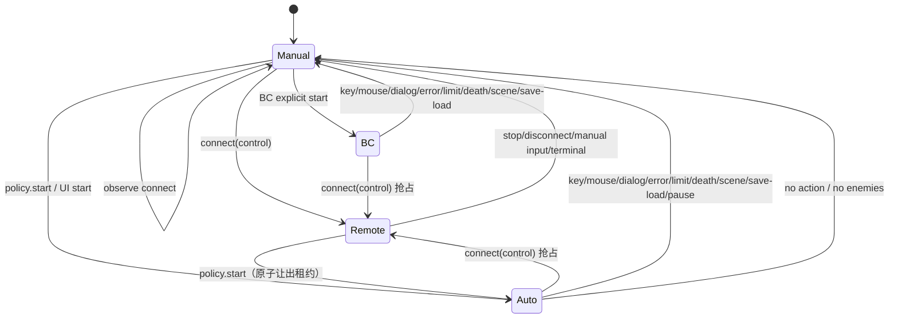
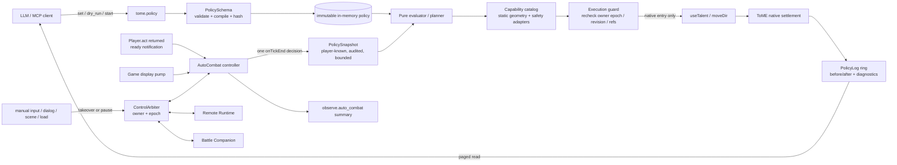

# AI 自动战斗与 ToME MCP Bridge 的架构评审

> 评审对象：ToME 1.7.6、`tome-mcp-bridge` 0.9.0 / protocol v4、`tome-auto_talent_assistant` 2.3.9、`tome-battle-companion`。  
> 评审日期：2026-09-16。本文只基于静态代码阅读；没有修改 addon/游戏文件，也没有把推断当成实机结论。

## 0. 结论先行

**B 的大方向成立，但当前方案必须修正执行时机、安全边界和 P1 范围。** “LLM 写版本化策略、本地原生侧逐回合执行”解决了网络往返延迟，也让策略可验证、可回放；它优于让 LLM 每回合发动作，也优于把 AI 生成的 Lua 当执行逻辑。

最重要的事实修正是：`Player:automaticTalents` 是 assistant 自己在 `Actor:act` superload 中触发的 hook 名，并不是 T-Engine 保证存在的原生 hook。原生同名的是 `Player:automaticTalents()` 方法，而且它在 `Actor:act()` 中、玩家进入 `game.paused=true` 的 ready 边界**之前**执行。新执行器不应依赖 assistant 的 hook，也不应把复杂评估塞进原生 `automaticTalents()`；应复用 Battle Companion 已验证的形态：`Player:act()` 返回后通知 ready，显示循环只负责 pump，再用带 session/owner epoch 的 `game:onTickEnd` 执行一项动作。

推荐的目标形态是：

- 一个中心化 `ControlArbiter`，统一 `manual`、`remote`、`auto_combat`、`battle_companion` 四种互斥 owner；所有排队动作在执行前再次比较 owner epoch。
- 一个纯数据、严格 schema、三值逻辑、fail-closed 的策略编译器和规划器。
- 一个小而显式的“安全能力/目标适配器”目录；`Actions.admit`、`TalentQuery`、`canProject` 都不能单独充当安全证明。
- 一个只走原生 `useTalent` / `moveDir` / `restInit` / `autoExplore` 的执行层；原生返回仍是最终规则裁决，但执行前必须完成可证明的观察和安全过滤。
- P1 缩为“战斗核心”：常驻、治疗/护盾、普通攻击、少量经审计的单体/直线/AoE、一步撤退。`rest` / `auto_explore` 可作为 P1b；自动换层不应进入最小 P1。

这不是实时性正确性问题：ToME 是回合制，A（远程逐动作）在 Boss、未知技能、复杂地形时仍是最安全模式；B 的主要收益是可用性和吞吐量，而不是绕过回合边界。

---

## 1. 事实核对：调用上下文、assistant、副作用和原生活动

### 1.1 原生 `automaticTalents()` 的真实时机

原生路径如下：

1. `Actor:act()` 先确认 energy 足够且角色未死（`game/modules/tome/class/Actor.lua:761-765`）。
2. 同一次 `Actor:act()` 中调用 `self:automaticTalents()`（`Actor.lua:773-777`）。
3. 原生 `Player:automaticTalents()` 会运行 `preUseTalent`，把可用技能排序为 instant 在前，并调用原生 `useTalent`；一次调用最多执行一个耗能技能，但可先执行多个零耗时技能（`game/modules/tome/class/Player.lua:960-1005`）。
4. `Actor:act()` 随后还会运行状态/回调并再次检查 energy（`Actor.lua:779-809`）。只有它返回后，`Player:act()` 才处理 rest/run，最后在仍可行动时设置 `game.paused=true`（`Player.lua:383-427`）；玩家消耗能量时 `Player:useEnergy()` 又将 paused 设回 false（`Player.lua:433-438`）。

所以，原生 `automaticTalents()` 内调用 `useTalent` 是原生已有做法，但它不是 MCP 定义的“稳定 ready 快照”边界。若在这里做复杂策略评估，会发生：

- 观察发生在 `callbackOnAct`、恐惧/混乱等后续处理之前；评估得到的状态不一定等于玩家最终 ready 时看到的状态。
- 可能与原生自动技能列表在同一调用中竞争 instant/耗能动作。
- MCP 当前只在其 `Player:act` wrapper 返回后调用 `Runtime.onReady`（`superload/mod/class/Player.lua:25-29`）；此时才与 `nativePhase() == "ready"` 的 paused、energy、无 tick-end 条件一致（`Runtime.lua:47-77`）。

**结论：**执行器应在 `Player:act()` 返回后的 ready 通知上工作，并把真正动作排到 `onTickEnd`；每次只执行一个动作，instant 技能通过下一次 pump 继续且受上限约束。这个时机允许安全调用原生 `useTalent`，又不占用 `Runtime` 的命令 `InvocationTracker`。当 `auto_combat` 是 owner 时不得存在远程 command；若存在则视为仲裁错误并暂停，而不是让两个 tracker 叠加。

### 1.2 assistant 的 hook 并非原生契约

`tome-auto_talent_assistant/superload/mod/class/Actor.lua:7-23` 定义了 `automaticAssistant()`，并在自己包装的 `Actor:act()` 返回 truthy 后触发 `Player:automaticTalents_BF`、`Player:automaticTalents`、`Player:automaticTalents_AF`。`hooks/load.lua:444` 绑定的是这个自造 hook。因此：

- 没有安装 assistant 时，新 addon 仅绑定该 hook不会被调用。
- MCP 现有 wrapper 只在 `Runtime.hasControl(self)` 时抑制原生 `Player:automaticTalents()` 方法（`superload/mod/class/Player.lua:31-35`），不会抑制 assistant 的独立 `automaticAssistant()` hook。
- assistant 与新执行器并装时存在双控制，即使双方“用了相同名字”也不代表共享一个锁。

assistant 的主体也远不只是选技能：`hooks/load.lua:589-593` 可移除 effect，`519-574`、`1826-1931` 涉及换装/工匠物，`596-632` 有队友控制，`1933-1999` 介入休息/探索；目标评分还用 RNG 做平局打散（如 `1742`），执行循环会调用 `preUseTalent` / `useTalent`。配置初始化和运行函数主要埋在约一万行的对话框实现中，状态放在 `actor.Assistant` 并随存档序列化。它适合人类使用的完整 addon，却不是稳定、纯、可审计的策略 ABI。

### 1.3 Battle Companion 给出的正确调度模板

Battle Companion 的 Player superload 在原生 `act()` 返回后调用 `Controller.onActorReady`（`tome-battle-companion/superload/mod/class/Player.lua:3-7`）；Game display wrapper 只调用 `Controller.pump()`（`.../superload/mod/class/Game.lua:3-7`）。Controller：

- 在 ready 通知处要求 `game.paused && enoughEnergy()`（`Controller.lua:116-124`）。
- 在 step 开头再次检查控制权、场景、对话、原生活动和状态（`58-86`、`130-143`）。
- pump 只排一个 `onTickEnd`，回调还比较 session（`185-198`）。
- 有 action/instant 上限，手动输入、地图切换、新敌人、错误均停止，不自动恢复（`130-168` 及其测试）。

新执行器应提取这种机制到 MCP 侧的共同仲裁层，而不是再用 `package.loaded` 做第三组双边握手。

### 1.4 `rest` / `auto_explore` 可复用的是生命周期模式，不是现有代码本身

MCP 当前已经具备关键概念：owner identity、开始/结束、turn cap、对话归属、stop、scene change、settling。证据包括：

- `Runtime.lua:323-376` 取消非本 command 所有的 rest/run，并在 revoke 时停止自己拥有的活动。
- `Runtime.lua:688-759` 等待 tick、原生任务、输入、场景变化和下一 ready 边界后才结算。
- `Runtime.lua:761-807` 启动原生 auto-explore、拒绝可见敌人并推进原生 run；`824-843` 走原生 `restInit`。
- `NativeTasks.lua:37-105` 为 remote invocation 跟踪 rest、弹窗、turn cap 和停止。

但 `NativeTasks` 当前假定 `Tracker.current()` 和 command id，auto-explore 也由 `Runtime` 的 active command 直接持有；它们不能原样被 AutoCombat 调用。应先抽出通用的 `NativeActivity(owner, owner_epoch, player, level, kind, native_identity, limits)`，让 remote 与 auto 共用；任何 owner 变更都停止该活动。P1a 不包含它们可显著降低风险。

---

## 2. 模型取舍与工作量

### 2.1 四个选项

| 方案 | 判断 | 原因 |
| --- | --- | --- |
| A：MCP 每动作驱动 | 保留 | 最容易审计和接管；适合 Boss、未知技能与调试。缺点只是往返和 LLM 成本。 |
| B：本地薄执行器 | **推荐，需按本文修正** | 延迟低；策略与执行分离；可做确定性 dry-run、回归和控制权证明。 |
| C：AI 写 Lua | 拒绝生产使用 | 策略可执行任意代码，无法约束隐藏信息、RNG、IO、存档或原生入口；只可用于隔离开发沙箱。 |
| D：翻译为 assistant 配置 | 只做固定版本实验/Phase 3 | assistant 没有稳定 schema，初始化、条件、目标、执行和 UI 状态紧耦合；翻译正确性与 addon 版本组合都难证明。 |

B 应是“薄控制器 + 纯 planner + 窄安全适配器”，不是一个缩小版 assistant。尤其不能把 `Actions.admit` 当成通用白名单：它只验证已学习、mode、入口存在和 `useTalent` 生命周期（`Actions.lua:41-53`）；`TalentQuery` 明确是 advisory，动态 range/target 为 unknown，且 readiness 最终仍是 `native_precheck_not_run`（`TalentQuery.lua:170-230`）。

### 2.2 是否复用 assistant

建议不复用其执行引擎。可借鉴条件分类和 UI 术语，但不得链接其运行状态：

- `actor.Assistant` 是实现细节而非 API，字段迁移和翻译失败很难 fail-closed。
- assistant 读/写范围比自动战斗大得多，带来装备、队友、rest/explore、effect 和 RNG 的额外副作用。
- 它自造 hook、保存运行态、可能弹 UI，无法纳入 MCP 的 revision、lease、command receipt 与 owner epoch。
- Battle Companion 已明确在检测到 `auto_talent_assistant` 时拒绝启动（`Controller.lua:82-85`）；P1 应沿用“冲突即拒绝”，而非尝试共享。

D 的可行形态只能是一个**固定 assistant 版本 + 明确字段映射 + 只生成配置、不直接启用 + 导入后人工确认**的适配器。它能覆盖复杂功能，却不能成为安全执行核心；assistant 升级或其它 addon 改写其函数时适配器必须失效。

### 2.3 粗略工作量（1 名熟悉 ToME/Lua/MCP 的工程师）

- 窄 P1a（本文最小战斗核心）：约 **3–5 工程周**，包括 Lua/Python/schema/文档/原生 fixture 和组合验收。
- 加入健壮的 rest/auto-explore、更多动态目标、决策回放：再 **2–3 周**。
- 用户原提案的完整 P1（逃跑、多类 AoE、rest、explore、换层同时交付）：约 **5–8 周**。
- D 看似可在 **2–3 周**做出演示，但生产级版本锁定、迁移、组合测试约 **6–10 周**，之后仍有持续维护成本，并不比 B 便宜。

---

## 3. 策略 schema v1 草案

### 3.1 设计规则

- JSON object 严格校验：`additionalProperties=false`；整数/字符串/数组均有上限；不接受 Lua 表达式、字段路径、函数名或正则回调。
- 策略中的 `limits` 只能把执行器编译期硬上限调低，不能放大；服务端/执行器的 hard cap 始终优先。
- `schema_version` 与 `executor_min_version` 分离；规范化后计算 `policy_hash`。同 id 不同 hash 视为不同策略。
- 条件使用 `true / false / unknown` 三值逻辑：`not unknown = unknown`；`all` 遇 false 为 false，否则有 unknown 即 unknown；`any` 遇 true 为 true，否则有 unknown 即 unknown。**只有 true 匹配规则**。
- 规则按 `priority` 降序、再按声明序、最后按 id 稳定排序；一个决策最多选择一个动作。互斥依靠 `exclusive_group`，不是并行执行。
- 所有 actor selector 只能消费当前 snapshot 中玩家可见且带本 level id 的 actor；坐标只能来自可见/remembered 地图或经审计的局部几何候选。

### 3.2 示例

下面片段展示完整表达能力；标成 `phase: "1b"` 的动作属于 schema 预留，不代表最小 P1a 必须实现。

```json
{
  "schema_version": 1,
  "policy_id": "halfling-astromancer-safe-v3",
  "executor_min_version": "0.10.0",
  "mode": "conservative",
  "limits": {
    "max_rules": 64,
    "max_condition_nodes": 256,
    "max_condition_depth": 8,
    "max_visible_actors": 32,
    "max_target_candidates": 96,
    "max_instant_actions_per_turn": 3,
    "max_actions_per_session": 200,
    "max_native_activity_turns": 500,
    "decision_soft_ms": 8,
    "decision_hard_ms": 20
  },
  "defaults": {
    "on_unknown": "skip_rule",
    "on_no_action": "pause",
    "on_scene_change": "pause",
    "on_new_hostile": "pause",
    "on_unsupported_interaction": "pause",
    "target_tie_break": ["distance", "actor_id", "x", "y"]
  },
  "safety": {
    "require_complete_snapshot": true,
    "forbid_unverified_getters": true,
    "max_self_fire_probability": 0,
    "max_friendly_fire_probability": 0,
    "forbid_unknown_area_geometry": true,
    "min_life_after_percent": 25,
    "resource_reserve": {"positive": 10, "negative": 5, "mana": 20},
    "stop_if_visible_hostiles_above": 6
  },
  "sustains": [
    {
      "id": "sun-cloak",
      "talent_id": "T_SUN_CLOAK",
      "priority": 900,
      "when": {"predicate": "sustain_active", "talent_id": "T_SUN_CLOAK", "equals": false},
      "resource_budget": {"positive": {"min_after": 15}},
      "failure": "pause"
    }
  ],
  "rules": [
    {
      "id": "emergency-heal",
      "priority": 1000,
      "exclusive_group": "recovery",
      "when": {"all": [
        {"predicate": "life_percent", "op": "lte", "value": 35},
        {"predicate": "talent_state", "talent_id": "T_HEALING_LIGHT", "equals": "candidate"}
      ]},
      "then": {
        "action": "use_talent",
        "talent_id": "T_HEALING_LIGHT",
        "target": {"selector": "self"}
      },
      "failure": "pause"
    },
    {
      "id": "safe-searing-light",
      "priority": 500,
      "exclusive_group": "offense",
      "when": {"all": [
        {"predicate": "visible_hostile_count", "op": "gte", "value": 1},
        {"predicate": "life_percent", "op": "gte", "value": 40}
      ]},
      "then": {
        "action": "use_talent",
        "talent_id": "T_SEARING_LIGHT",
        "target": {"selector": "best_aoe", "prefer_hostiles": 2, "max_candidates": 48},
        "area_safety": {"self": "forbid_damage", "allies": "forbid_damage"}
      },
      "resource_budget": {"positive": {"min_after": 10}},
      "failure": "try_next_if_pristine"
    },
    {
      "id": "focus-single",
      "priority": 400,
      "exclusive_group": "offense",
      "when": {"predicate": "visible_hostile_count", "op": "gte", "value": 1},
      "then": {
        "action": "use_talent",
        "talent_id": "T_MOONLIGHT_RAY",
        "target": {"selector": "highest_rank", "within": "audited_range", "line": "required"}
      },
      "failure": "try_next_if_pristine"
    },
    {
      "id": "retreat-one-step",
      "priority": 950,
      "exclusive_group": "recovery",
      "when": {"any": [
        {"predicate": "life_percent", "op": "lte", "value": 25},
        {"predicate": "hostile_adjacent_count", "op": "gte", "value": 3}
      ]},
      "then": {
        "action": "move",
        "target": {"selector": "safest_step", "known_only": true, "avoid_ground_effects": true}
      },
      "failure": "pause"
    },
    {
      "id": "rest-when-clear",
      "phase": "1b",
      "priority": 100,
      "when": {"all": [
        {"predicate": "visible_hostile_count", "op": "eq", "value": 0},
        {"predicate": "rest_needed", "equals": true}
      ]},
      "then": {"action": "rest", "max_turns": 200, "stop_on": ["hostile", "damage", "dialog", "resource_full"]},
      "failure": "pause"
    },
    {
      "id": "explore-when-ready",
      "phase": "1b",
      "priority": 50,
      "when": {"all": [
        {"predicate": "visible_hostile_count", "op": "eq", "value": 0},
        {"predicate": "frontier_count", "op": "gt", "value": 0}
      ]},
      "then": {"action": "auto_explore", "max_turns": 300},
      "failure": "pause"
    },
    {
      "id": "leave-cleared-level",
      "phase": "2",
      "priority": 10,
      "when": {"predicate": "level_clear", "equals": true},
      "then": {"action": "change_level", "target": {"selector": "known_exit", "direction": "configured"}},
      "failure": "pause"
    }
  ]
}
```

### 3.3 谓词白名单 v1

P1a 只建议以下谓词；每个谓词在编译后绑定固定 evaluator，不允许策略指定任意对象路径：

- 自身：`life_percent`、`resource_current`、`resource_percent`、`effect_present`（仅已知自身 effect id）、`sustain_active`、`position_known`。
- 技能：`talent_learned`、`talent_cooldown`、`talent_affordable`、`talent_state`。其中 `candidate` 表示静态检查已通过，不表示原生 `preUseTalent` 一定成功。
- 场景：`visible_hostile_count`、`hostile_adjacent_count`、`visible_ally_count`、`ground_effect_at_self`、`snapshot_complete`、`new_visible_hostile`。
- 目标：`target_distance`、`target_life_percent`、`target_rank`、`target_reaction`、`line_clear`；只作用于候选中的可见 actor。
- P1b：`rest_needed`、`frontier_count`、`known_exit_count`；P2 才考虑 `level_clear`，因为“无可见敌人”不等于清层。

不得提供 `eval_lua`、任意 `getter`、`field_path`、`call`、`chance`、`random`、未审计的 tactical AI 值，或按隐藏 uid 直接找 actor。

### 3.4 动作、selector 与失败语义

动作白名单：

- P1a：`set_sustain`、`use_talent`、`attack`、`move`、`wait`（默认不使用）。
- P1b：`rest`、`auto_explore`。
- P2：`change_level`；必须显式指定出口方向/标签并在场景变化前后停机。

目标 selector：`self`、`nearest`、`lowest_life`、`highest_rank`、`best_line`、`best_aoe`、`safest_step`、`known_exit`。所有 selector 必须输出“候选 + 证据”，不能只输出坐标。稳定 tie-break 禁止 RNG。

失败处理只有三种：

- `pause`：默认，交还 manual；原生动作抛错、弹出未知 UI、花费能量、位置/资源/effect 发生意外变化时必须用它。
- `try_next_if_pristine`：仅当 `energy_spent == 0`，且位置、资源、冷却、sustain/effect、dialog、level 和 owner epoch 均未改变时才可尝试下一规则。
- `end_session`：无敌人、动作上限等正常终止；仍回到 manual，不自动 resume。

### 3.5 AoE 与 selffire 的正确建模

不能把 `selffire` 简化成布尔：`spellFriendlyFire()` 返回 0–100 的概率（`Combat.lua:2092-2100`），真正 project 时 numeric 值会调用 `rng.percent`（`ActorProject.lua:253-255`）。因此 planner 只计算风险，不投骰：保守模式下只要玩家在伤害区域内且概率 `> 0` 就拒绝；概率 unknown 也拒绝。友军同理。

三个具体技能说明了为什么需要经审计的“技能语义适配器”：

- Searing Light 的 target UI 是 radius-1 ball，但直接伤害用 `{type="hit"}`，残留地面 effect 明确传 `false, false`（`sunlight.lua:22-54`），所以不能因光标是 ball 就误判会自伤/伤友。
- Shadow Blast 的即时投射和残留 effect 都使用 `spellFriendlyFire()`（`star-fury.lua:55-88`）。
- Starfall 的 target 也携带 numeric selffire（`star-fury.lua:140-161`）。

适配器只描述版本锁定的 shape、伤害区域、残留区域、selffire/friendlyfire 来源和目标入口；它不实现施法。来源文件、digest、函数 identity 任一变化就变 unknown。现有 `ActorCombat.lua:18-34` 仅用 source suffix 判 getter，强度不足；若这些 computed 值参与授权，必须升级到 `NativeCompatibility.lua:65-120` 的 path + full digest + declaration + identity + dependency closure。

也不应在 dry-run 泛用调用 `canProject`：它会通过 `Target:getType` 构造动态 target，并可执行 `typ:block_path` 回调（`ActorProject.lua:286-342`）。P1 应使用经审计的静态 target adapter 和纯几何；不能证明的动态 target 一律 unknown。原生 `useTalent` 执行时仍会做最终 `canProject` 和合法性判断。

---

## 4. 校验与 dry-run

### 4.1 两级校验

**set-time 静态校验**：JSON 大小、schema/version、未知字段、节点/深度/规则上限、唯一 id、合法谓词/selector/action、人才 id 字符串、资源名、数值范围、P1 capability、策略 hash。它不接触游戏对象。

**decision-time dry-run**：在一个 ready revision 上先建立不可变 `PolicySnapshot`，再编译求值：

1. 捕获玩家已知的 actor、地形、ground effect、talent stored scalars 和经审计 computed 值。
2. 若 actors/map/candidates 被截断且相关规则需要完整集合，结果为 unknown，不可选择动作。`Observer.capture` 当前最多 32 个 actor并标 truncation（`Observer.lua:115-143`）。
3. 对每条规则记录条件树结果和 unknown 原因。
4. 为 true 的规则生成有界候选，做资源 after-budget、区域风险、静态射程/纯几何检查。
5. 选出唯一动作，但不运行任何原生写入口。

`TalentQuery` 的纯度边界值得保留：它明确不调用 action、`preUseTalent`、动态 info/require 或未审计 getter（`TalentQuery.lua:1-7`）。dry-run 也不得调用 `t.target()`、`getTalentTarget`、`preUseTalent`、`useTalent`、`canProject`、攻击 roll、DamageType projector、地图 `projected` callback 或任意 RNG。可见性应读取玩家 FOV/cache并对 blind/stealth 保守降级；不得为了“确认”而重算 FOV。

### 4.2 建议诊断格式

```json
{
  "policy_id": "halfling-astromancer-safe-v3",
  "policy_hash": "sha256:...",
  "schema_version": 1,
  "snapshot": {"revision": 184, "world_tick": 9921, "level_instance_id": "...", "complete": true},
  "valid": true,
  "would_execute": false,
  "selected": null,
  "rules": [
    {
      "id": "safe-searing-light",
      "priority": 500,
      "condition": "true",
      "candidates_examined": 7,
      "result": "rejected",
      "reasons": [
        {"code": "area_geometry_unverified", "path": "/rules/1/then", "detail": "talent adapter digest mismatch"}
      ]
    },
    {
      "id": "focus-single",
      "condition": "unknown",
      "result": "skipped",
      "reasons": [
        {"code": "range_unknown", "path": "/rules/2/then/target/within", "source": "dynamic talent range"}
      ]
    }
  ],
  "unknown_inputs": ["talent:T_SEARING_LIGHT.area"],
  "limits": {"condition_nodes": 11, "target_candidates": 7, "elapsed_ms": 1.7},
  "side_effects": false
}
```

错误码要稳定、机器可读；文本 detail 只作人类提示。dry-run 结果绑定 `revision + level_instance_id + owner_epoch + policy_hash`，不能在 revision 变化后直接执行。

---

## 5. 仲裁、所有权与状态机

### 5.1 从双边握手升级为中心仲裁

当前 MCP 对 BC 的行为是正确但不可继续扩展的：`connect control` 先 revoke 旧命令，再调用 BC `remoteTakeover`，最后才发 control token（`Runtime.lua:946-969`）；BC 又在 start、ready、step、pump/queued callback 都检查 bridge（`Controller.lua:58-86, 116-198`）。`connect_observer` 不抢 BC，现有测试覆盖了 observer 不写、control takeover、排队取消和不自动恢复（`tests/test_runtime.lua:199-228`）。

引入第三个 owner 后，应新增唯一真相源：

```text
ControlArbiter.state = {
  owner: "manual" | "remote" | "auto_combat" | "battle_companion",
  epoch: monotonically increasing integer,
  lease_id: opaque runtime-only token or null,
  player_identity,
  level_identity,
  reason
}
```

`acquire/takeover/release` 必须原子地：epoch++、取消旧 owner 的 queued action、停止旧 owner 的 native activity、再公布新 owner。任何 executor callback 持有 `{owner, epoch, player, level}`；四项不全等就无副作用返回。

### 5.2 生命周期



强制语义：

- `connect_observer` 永不抢占任何本地 owner。
- `connect control` 先暂停 auto/BC、invalidate queue、停止其 owned activity，再发 remote token；顺序不可反转。
- manual 输入总是最高优先级，立即 epoch++；`Input.lua` 现有“手动输入撤销/断开”语义应改为调用 arbiter。
- `auto_combat` 持有 owner 时必须抑制玩家原生 `talents_auto` 的 `automaticTalents()`，否则它会在 ready 通知前先花能量；回到 manual 后恢复原生行为。legacy assistant 因为走另一条自造 hook，仍按冲突拒绝处理。
- disconnect/`stop`/手动输入/存档读档/换层/死亡后**绝不自动恢复** auto；只有新的显式 start 可运行。
- policy 纯数据可以由客户端保管并在新 session 重发；P1 不把 enabled、queue、function ref、socket、lease、epoch 或 native activity 写入存档。读档后 policy status 为 `absent` 或 `paused_needs_set`。
- 检测到 legacy assistant 时 P1 `start` 直接返回 `legacy_assistant_conflict`。BC 与 auto 也互斥，不允许一方静默覆盖另一方。
- addon superload 是组合链，实际加载顺序仍须在“仅 MCP / +BC / +assistant / 三者并装”四种安装上验证，不能靠 weight 推断 wrapper 顺序。

### 5.3 MCP 接口建议

将用户提议的 `tome.policy` 做成一个 discriminated operation：

- `set(policy, expected_revision, control_token)`：校验、编译、保存在内存；**不启动**。
- `clear(control_token)`：清除配置；若正在运行，先 pause。
- `dry_run(policy? | policy_id, expected_revision)`：纯读取；返回上节诊断，不占用 owner。
- `start(policy_id, expected_revision, control_token)`：仅在 ready 时原子把 `remote -> auto_combat`；返回 runtime-only `automation_token` 和 owner epoch，远程 action token 立即失效。
- `pause(automation_token)`：只暂停匹配的 auto owner。另一个客户端要接管应重新 `connect control`，不能猜 token。
- `status`：纯读取。

现有 `stop` 继续表示停止 remote lease；若当前是 auto，客户端要么提交正确 `automation_token` 的 `pause`，要么 `connect control` 明确抢占。这样“已认证连接”不等于“任意控制权”。Python tool schema 与 protocol v4 contract 必须同步。

`observe.auto_combat` 保持小而稳定：

```json
{
  "enabled": true,
  "state": "running",
  "policy_id": "...",
  "policy_hash": "sha256:...",
  "schema_version": 1,
  "owner_epoch": 19,
  "actions": 12,
  "last_decision_ids": [187, 186],
  "paused_reason": null
}
```

完整决策另由分页的 `tome.policy_log(after_cursor, limit)` 读取，避免每个 snapshot 膨胀。

---

## 6. 安全、反作弊与审计边界

“策略是数据”是必要条件，但不是充分条件。安全链应为：

1. **输入能力**：严格 schema 和资源上限，策略不能表达代码、反射或任意字段访问。
2. **观察能力**：只用玩家已知状态。`Observer.resolve` 只返回当前可见 actor（`Observer.lua:104-113`）；地图只含 remembered/安全可见地形（`LevelMap.lua:68-128`）。不得遍历 entity 列表后把不可见 actor 加入候选。
3. **计算能力**：只调用 digest/identity 审计后的纯 getter，RNG 和动态 callback 禁止；unknown fail-closed。
4. **动作能力**：动作必须有明确 capability/adapter，再由原生入口执行。执行前复查 owner epoch、revision、player/level、目标仍可见、预算和候选证据。
5. **结算能力**：只接受原生能量、冷却、资源、命中与地图规则；禁止直接写 life、energy、cooldown、talent state、坐标、effect 或 RNG state。

下列原生函数在 planner/dry-run 中必须禁止：`preUseTalent`、`useTalent`、talent `action/activate/deactivate`、动态 `target/range/radius/info/require`（除非逐项登记为纯依赖）、`getTalentTarget`、通用 `canProject`、`project`、DamageType projector、`map:checkAllEntities(..., "projected")`、FOV 重算、任何 rest/run step 和 RNG。它们只能在窄执行边界或经完整纯度审计的 adapter 内出现。

原生入口不会自动证明“动作对自动化安全”：一个合法 talent action 可以换层、召唤、打开 chat/dialog、要求二次输入或运行 addon callback。执行层必须保留 MCP 现有的 dialog/input ownership、异常、不确定状态和 fail-stop 语义。无法 sandbox 的副作用只能靠小 capability catalog、版本审计和事后状态比较控制。

反作弊规则：

- actor id 必须带 level scope，旧 level id 拒绝；目标执行前重新 resolve。
- 若 snapshot/candidate 截断，依赖全集的 `nearest/best_aoe/visible_hostile_count` 为 unknown。
- 不使用完整 `level.entities` 做规划；即便只是“计数”也会泄露隐身或远处敌人。
- 不自行调用 talent getter“看看会不会随机”；不预掷 selffire/命中概率。
- 不用失败动作刷资源：任何资源/冷却/effect/位置变化都阻止 try-next；异常结果进入 paused/uncertain。
- 资源预算检查是前置保守门；最终资源变化以原生结果为准，越界即停止并记录，而不是回滚。

---

## 7. 决策日志、Journal 与回放

建议独立的内存环形日志（例如 256 decisions、每项有字节上限），每项记录：

- `decision_id`、policy id/hash/version、snapshot revision/world tick、level id、owner epoch。
- snapshot completeness 和使用过的字段/审计版本；不复制整个世界状态。
- 每个被检查规则的 condition 三值、短路点、unknown/reject code。
- 候选数量、被截断情况、稳定排序 key；入选目标的 actor id/坐标和可见性证据。
- 动作前后：energy、位置、相关资源、cooldown、sustain/effect 摘要、journal cursor、dialog/level。
- 原生返回、energy spent、是否 instant、执行耗时、最终状态和 pause reason。

当前 `Journal` 只是玩家可见日志文字的有界 delta（256 项；`Journal.lua:1-4, 76-92`），可把 before/after cursor 关联进 decision，但不能把文本解析当权威命中结果。`Actions.execute` 自己也注明普通攻击返回 true 不代表命中（`Actions.lua:275-286`）。因此 P1 记录：

```text
action_accepted = true|false
energy_spent = n
hit_result = "unknown"
damage_result = "unknown"
journal_cursor_before/after = ...
```

若 P2 需要准确命中/伤害，应新增只观察玩家可见战斗事件的原生 seam，附 actor level-scope id 和 event sequence；不能靠日志自然语言猜。事件 ring 与 decision ring 可共同导出 NDJSON fixture，用于离线 replay：给定同一规范化 PolicySnapshot，planner 必须产生相同 rule/target/action。A/B 调参比较存活、回合数、资源消耗、pause 率、unknown 率和伤害事件，但不要把 RNG 战斗结果误归因于 planner 的确定性。

---

## 8. 性能设计

不要在 `automaticTalents` 或 display 热路径反复编码 JSON、扫描全图或运行所有 getter。建议：

- `set` 时完成 schema 校验、AST 编译、常量折叠、谓词/技能索引、规则稳定排序和 capability resolution。
- 每个 decision 只生成一个不可变 snapshot；字段按谓词需求 lazy capture。同一 getter、talent query、距离、line、AoE mask 在 decision 内缓存。
- 先评估高优先级廉价谓词；false 短路。只有已通过规则才展开目标候选。
- visible actor 建 `actor_id -> ref`、hostile/ally、距离 bucket 索引；候选和 area cells 均设上限。
- actor/candidate/map 任一截断不能静默降质；标 unknown 并 pause/skip。
- tie-break 固定为 distance、actor_id、坐标；不调用 RNG。
- 一个 `onTickEnd` 最多一个动作；同一 turn 的 instant 最多 3 次，总 actions/native turns 均有限额。
- `decision_soft_ms` 超过后停止低优先级评估；`hard_ms` 或异常立即 pause。用 monotonic wall clock 只做预算，不参与选择结果。
- 日志先写小结构到 ring；MCP 读取时才 JSON 序列化。执行 callback 内不做文件 IO、网络等待或大段 log。

---

## 9. 测试计划与最小验收集

### 9.1 纯单元测试

- JSON schema：unknown field、版本、大小、节点/深度、重复 id、非法资源/谓词/selector/action。
- 三值逻辑和短路；priority、声明序、exclusive group、稳定 tie-break。
- resource `min_after/max_after`、failure `try_next_if_pristine`、instant/action/session limit。
- snapshot truncation、getter unknown、adapter digest mismatch 均 fail-closed。
- dry-run purity：把 `rng.*`、`preUseTalent`、`useTalent`、target/range callbacks、`canProject`、FOV 重算替换为抛错探针，断言调用次数为 0；沿用 `tests/test_query_purity.lua` 的思路。
- replay：同一 normalized snapshot 连续运行得到逐字节相同的 selected/diagnostics（耗时字段除外）。

### 9.2 原生 fixture / 实机场景

- 普攻、self heal、shield、sustain on/off；冷却/资源不足由 planner 拒绝，原生 precheck 再作最终裁决。
- 单体/beam 的射程、墙角、目标死亡/隐身/换层；执行前目标丢失不花能量。
- Searing Light：目标 UI 为 ball 但不误判自伤；Shadow Blast/Starfall：玩家在 area 且 selffire probability > 0 时保守拒绝，玩家不在 area 时可继续评估。
- AoE 中友军、残留 ground effect、dynamic radius unknown、candidate truncation。
- heal 阈值、资源 reserve、一步撤退无安全格时 pause。
- 原生动作返回 false 但耗能、动作打开 popup、抛错、发生意外 cooldown/effect/position 变化时不尝试下一规则。
- `rest` / `auto_explore`（P1b）被敌人、伤害、dialog、manual、remote takeover、map change 中断并停止自己的原生活动。

### 9.3 仲裁和组合测试

- manual、remote、auto、BC 任意时刻只有一个 owner；epoch 单调。
- auto 排队后 manual input、`connect control`、pause、save/load、scene change、death：队列均不执行。
- `connect_observer` 不抢占；失败认证不抢占；remote takeover 后 auto 不恢复。
- start 是 `remote -> auto` 原子交换，旧 control token 无法 act，错误 automation token 无法 pause。
- legacy assistant 安装时 auto start 明确拒绝；BC running 时同样拒绝/由显式 takeover 处理。
- 四个 addon 组合安装矩阵验证 superload wrapper 次序和唯一 ready 通知。

现有证据可直接作为基线：`tests/test_runtime.lua:199-228` 已覆盖 observer/BC/remote 交接；Battle Companion 的 `tests/test_controller.lua:37-125` 已覆盖 session queue、输入、边界、instant cap、reset、不自动恢复、remote queued recheck。新增测试不应只复制这些，而应把它们迁移到共同 Arbiter 的契约测试。

### 9.4 最小验收标准

1. 连续 1,000 个 ready 决策中 dry-run 无 RNG/无写；相同 snapshot 结果确定。
2. 所有 takeover fixture 中旧 epoch 的 queued callback 执行动作数为 0。
3. 只对当前可见、同 level actor 行动；截断/unknown/digest mismatch 均不施法。
4. 每个 ready callback 最多一个 native action；instant、总 action、decision time 均可证明有界。
5. 目标丢失/资源变化/原生拒绝/未知 UI 不崩溃、不继续连击，返回稳定 pause reason。
6. Searing/Shadow Blast/Starfall 三个 selffire fixture 按真实语义通过。
7. save/load、断线、手动输入、换层、死亡后 state 为 manual/paused，绝不自动恢复。
8. Lua 单测、Python schema/tool 测试、protocol vector、原生 fixture 与四种 addon 组合验收全部通过。

---

## 10. 风险、开放问题与最小 Phase 1

### 10.1 可能推翻或显著缩小 B 的因素

1. **动态技能覆盖率过低。** 大量 talent 用函数生成 range/target/radius。若目标职业的关键技能都不能通过窄 adapter 审计，B 仍成立为架构，但产品价值可能不足；必须先做 2–3 个目标职业的 coverage spike。
2. **addon 组合顺序不可控。** assistant 或别的 addon 包装 `Actor/Player/Game` 后，身份审计可能全部 fail-closed；这应导致“不可用”，不能退化为弱审计。
3. **原生 action 的不可预见副作用。** 即使经 `useTalent`，talent 仍可能打开 UI/换层/调用 addon callback。P1 catalog 若太宽会破坏“薄且可证明”的前提。
4. **自动化边界定义不清。** 若目标是“任何职业、任何 addon、任何技能皆自动”，则固定安全 catalog 不现实，应退回 A 或接受明显更弱的安全模型。
5. **命中/伤害可观测不足。** 如果验收要求精确归因和在线学习，现有 Journal 不够，P2 event seam 会变成 P1 前置。

### 10.2 必须由人拍板

- P1 支持哪 1–2 个职业、哪些 talent；选择“少量 version-pinned adapter”还是只支持静态 target talent。
- 保守策略是否规定：任何 unknown 都 pause，还是只 skip 当前 rule；本文建议安全类 unknown 必须 pause，其它规则输入 unknown 可 skip。
- 遇到新可见敌人是否总 pause；Battle Companion 的当前策略是 pause，建议 P1 保持。
- 允许的最大 selffire/friendlyfire 概率；本文默认 0，不建议让 P1 自动投概率风险。
- manual 输入是只 pause 还是直接断开 MCP transport；无论 UI 如何，owner 必须先回 manual。
- policy 是否允许外部持久化。本文建议 P1 由客户端持有、每个 session 重发，不写入游戏存档。
- `rest/auto_explore` 是否值得放进首个可用版本；自动换层是否永远要求显式 opt-in。
- 是否接受安装 legacy assistant 时完全拒绝 auto；本文建议接受，Phase 3 再评估固定版本适配。

### 10.3 最小 Phase 1（P1a）具体清单

**Lua 模块**

- 新增 `overload/mod/mcp_bridge/ControlArbiter.lua`：owner/epoch/lease、atomic takeover、listeners、reset。
- 新增 `overload/mod/mcp_bridge/PolicySchema.lua`：严格 schema、normalize/hash、limits。
- 新增 `overload/mod/mcp_bridge/PolicySnapshot.lua`：一次性玩家已知快照、审计 getter、truncation。
- 新增 `overload/mod/mcp_bridge/PolicyEvaluator.lua`：三值条件、priority、diagnostics。
- 新增 `overload/mod/mcp_bridge/AutoCombat.lua`：状态机、ready/pump/onTickEnd、限额、pause。
- 新增 `overload/mod/mcp_bridge/AutoCombatCatalog.lua`：少量声明式 talent/target adapter；不含施法脚本。
- 新增 `overload/mod/mcp_bridge/PolicyLog.lua`：有界 decision ring。
- 修改 `Runtime.lua`：`tome.policy`/policy log dispatch、control source、arbiter 交接、观察摘要。
- 修改 `Observer.lua`：挂小型 auto summary；必要时暴露有界、已知的候选信息。
- 修改 `NativeCompatibility.lua` / manifest：把 planner 使用的 computed getter 和 adapter 来源纳入 digest/identity/closure。
- 修改 Player/Game/Input superload：统一 ready 通知、pump 和 manual takeover；避免为每个控制器叠加 wrapper。
- Player wrapper 在 owner 为 `remote` 或 `auto_combat` 时抑制原生 `automaticTalents()`；manual/BC 的既有语义由仲裁契约明确决定。
- 暂不抽 `NativeActivity`；P1a 不做 rest/auto-explore/change_level。P1b 再重构 `Runtime` / `NativeTasks`。

**MCP / 协议**

- `server/src/tome_mcp/server.py` 增加严格的 `tome.policy` 与分页 `tome.policy_log` tool schema。
- protocol v4 增加 policy request/result/common/limits/vector；若兼容语义无法扩展则明确升 v5，不得悄悄改 v4。
- snapshot `control_source` 枚举加入 `auto_combat`；capabilities 公布 schema/executor version、支持的谓词/动作/selector/talent adapters。
- 更新 `docs/tome-mcp-api-fields.md`、架构、控制仲裁、自动战斗安全契约和 README；所有未知/截断/概率语义写成规范。

**P1a 能力边界**

- set/clear/dry_run/start/pause/status、observe summary、decision log。
- self sustain、self heal/shield、普通攻击、一个静态单体、一个 beam、经 fixture 的 Searing/Shadow Blast/Starfall adapter、一步 safest retreat。
- 不做队友命令、装备、物品、召唤管理、rest、auto-explore、换层、assistant 翻译、在线学习。

**测试文件/证据**

- Lua：`tests/test_policy_schema.lua`、`test_policy_evaluator.lua`、`test_policy_purity.lua`、`test_auto_combat_controller.lua`、`test_control_arbiter.lua`、`test_auto_combat_catalog.lua`。
- 扩展 `tests/test_runtime.lua` 和 Observer/compat tests；增加真实 addon 组合 runner。
- Python：tool schema、请求编码、错误映射、分页日志、protocol vectors。
- 原生：固定角色/技能 fixture，至少覆盖三类 AoE、目标丢失、dialog、manual/remote takeover、save/load/scene/death。
- 归档测试报告必须含原始 JSON：owner epoch、policy hash、决策日志、native before/after 和 pause reason。

---

## 架构图



关键不变量只有一句话：**planner 可以拒绝原生允许的动作，但绝不能授权一个无法从玩家已知、经审计快照和当前 owner epoch 证明安全的动作；最终执行仍必须由原生规则结算。**
